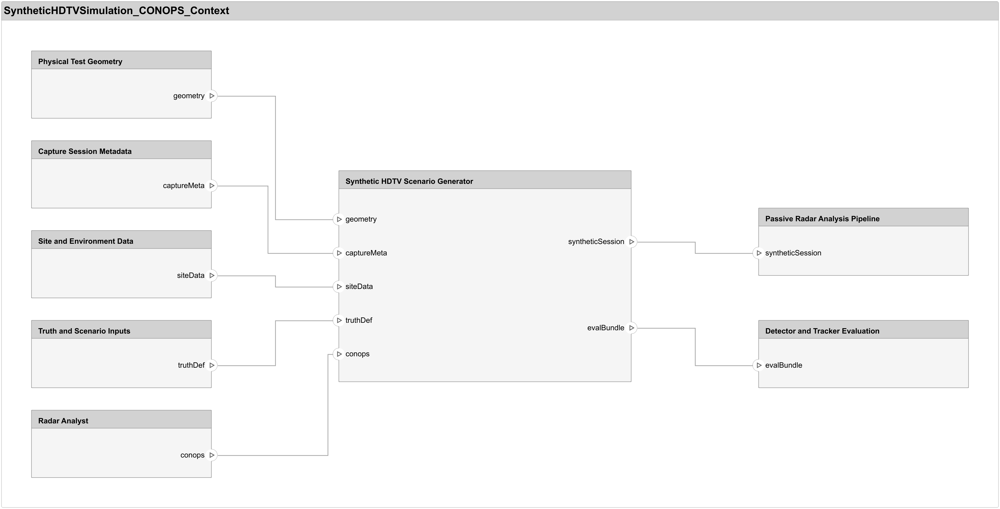

# Flight Test Data Collection & Passive Bistatic Radar System

## Project Overview

This repository contains a complete passive bistatic radar system and multi-sensor data collection platform for aircraft detection, localization, and tracking validation. The system is designed to generate shareable datasets for verifying MATLAB Radar and Sensor Fusion and Tracking Toolbox functions.

## Phase Status

The project now has an approved CODRTIV v2 `CONOPS` baseline, an approved `Requirements_Packet.md`, an approved `Requirements_Review_Packet.md`, an approved [Design_Packet.md](Design_Packet.md), an approved [Verification_Spec.md](Verification_Spec.md) from the `Independent Quality Gatekeeper`, and a final [Red_Team_Report.md](Red_Team_Report.md) for a tight synthetic HDTV simulation effort tied to the current passive bistatic radar workflow. The project is now in `Implementation Loop`, with the packaged-session baseline and the seed-backed HDTV synthesis path implemented for the approved Apple Hill and CBS scenario.

- Related brief: [CONOPS_Brief.md](CONOPS_Brief.md)
- Context model: [SyntheticHDTVSimulation_CONOPS_Context.slx](SyntheticHDTVSimulation_CONOPS_Context.slx)
- Current diagram export: [docs/CONOPS-SystemContextDiagram.png](docs/CONOPS-SystemContextDiagram.png)
- Approved submitted requirements packet: [Requirements_Packet.md](Requirements_Packet.md)
- Approved requirements review packet: [Requirements_Review_Packet.md](Requirements_Review_Packet.md)
- Approved design packet: [Design_Packet.md](Design_Packet.md)
- Gatekeeper-approved verification spec: [Verification_Spec.md](Verification_Spec.md)
- Final red-team report: [Red_Team_Report.md](Red_Team_Report.md)
- Current execution record: [Execution_Packet.md](Execution_Packet.md)
- Current expert council assessment of the synthetic pipeline: [ExpertReview.md](ExpertReview.md)
- ADS-B-to-range-Doppler projection review and claim boundary: [ADSBAlgoReview.md](ADSBAlgoReview.md)

Current requirements baseline decisions:
- Output contract: synthetic radar session data, truth, and compatible metadata
- Workflow boundary: the existing passive radar analysis workflow remains the detector and tracker of record
- Site fidelity: include DTED-derived terrain-surface context near the approved Tx/Rx locations in v1; no building models required
- Terrain asset status: the Apple Hill terrain tile `n42_w072_1arc_v3.dt2` is now present in the repo root and has been smoke-tested successfully with both `readgeoraster` and `addCustomTerrain`; the file spans latitude `[42, 43]` and longitude `[-72, -71]`, which covers the Apple Hill / Needham geometry for v1 terrain-backed simulation inputs
- Provenance: require manifest-level fields for `data_origin`, `scenario_id`, `generator_name`, `generation_time_utc`, `truth_source`, and `random_seed` when stochastic generation is used
- Reproducibility boundary: truth and metadata must reproduce across reruns; synthetic radar session data itself does not need to reproduce across reruns
- Current implementation status: the generator now supports `zero_channels_v1` and `seed_backed_bistatic_v1`, defaults the primary seed-backed path to the toolbox-native `toolbox_wideband_free_space_v1` echo model with conditioned target echoes, resolves manifest-backed seed sessions across all listed radar parts, can switch truth generation to capture-backed ADS-B with `truthSourceMode = "auto"` when a packaged session includes ADS-B, records truth-window/filter/gain-policy metadata in the session manifest, preserves per-part synthesis summaries in the returned artifact, saves an additive full-session archive companion at `archive/synthetic_session_archive.mat`, and includes a user-facing plain-text `.m` walkthrough live script at [SyntheticHDTVSimulation/seedBackedSyntheticHDTVSessionWalkthrough.m](SyntheticHDTVSimulation/seedBackedSyntheticHDTVSessionWalkthrough.m) that frames the run as explicit validation questions, runs the session-level signal-physics readiness gate after generation, prints a midpoint-CPI raw-RDM truth spot-check table for the first eligible retained targets, and reports downstream truth-match numbers in the walkthrough itself
- Current open gap: the seed-backed workflow is still an intermediate development model, not a field-surrogate scene model. Conditioned target echoes currently reduce the severity of the pilot-driven target-Doppler vertical-column artifact relative to the full-seed comparison mode, but that artifact can still appear in downstream comparison studies and remains part of the broader synthetic-fidelity gap

Caption: The approved `CONOPS` view keeps the diagram at the context boundary only. It shows the simulation effort as an operational bridge between the existing field setup and the downstream detector-evaluation workflow, without committing to algorithm internals or implementation structure.



## Synthetic Data Generation

### Phase 1: Seed-Backed Intermediate Synthetic Scene Model

This is the current low-fidelity synthetic data generation phase. It is useful for algorithm plumbing, truth alignment, delay and Doppler sanity checks, mitigation debugging, packaged-session compatibility, and controlled regression work. It is not a field-equivalent scene model and should not be treated as the final benchmark for detector or tracker performance.

In simple language, the waveform generation approach is:

- We do **not** synthesize a new HDTV broadcast from bits, video content, or a transmitter model.
- We start with a short chunk of already TV-like baseband IQ called the **seed waveform**. That seed comes from either a real capture or a deterministic probe seed.
- The **reference channel** is built as a scaled copy of that seed. It stands in for what the illuminator looks like at the reference antenna.
- The **surveillance channel** starts as another copy of the same seed, with a small configured delay and gain change. That stands in for the direct-path leakage into the surveillance antenna.
- The user defines target motion with waypoints and times. The code samples those paths over the active window, then converts the motion into bistatic **range excess** and **Doppler** truth.
- For each target, the generator makes another copy of the seed waveform and turns it into an echo by applying the target's delay, Doppler, and echo gain. All of those per-target echoes are summed into the surveillance channel.
- In the recommended default mode, only the **target-echo seed copy** is lightly conditioned before echo generation. The reference channel and direct-path copy still use the full seed.
- That conditioning is a practical workaround: it suppresses the strongest pilot-like narrowband line in the seed so the generated echoes are less likely to create truth-aligned full-height Doppler columns in the post-mitigation RDM.
- The full-seed mode is still available as a comparison/reference dataset, but it is not the recommended basis for downstream algorithm scoring while the vertical-column artifact persists.

The current implementation uses these native MATLAB pieces under the hood:

- `geoTrajectory` and `lookupPose` to sample target motion from user-defined waypoints
- `adsbToBistatic` to convert sampled motion into bistatic range/Doppler truth
- `phased.WidebandFreeSpace` to build the current toolbox-native target-echo propagation analogue
- `dsp.VariableFractionalDelay` to apply sub-sample delays
- `periodogram`, `designfilt`, and `filtfilt` to build the conditioned target-echo seed copy

The important downfalls and limits are:

- The synthetic waveform is still **seed replay**, not a full illuminator-generation model. Any quirks in the seed waveform get reused in the synthetic data.
- The target echoes are still copies of that one seed waveform with delay, Doppler, and gain changes. That is much simpler than real scattering physics.
- The conditioning step is a **workaround**, not a physical propagation effect. It makes the dataset more usable, but it is not claiming realism.
- Target amplitude behavior is simplified to per-target echo gains. The model does not yet capture richer time-varying RCS, glint, aspect-dependent scattering, or detailed airframe scattering structure.
- The scene does not yet include benchmark-grade terrain clutter, land clutter, building multipath, or site-specific environmental richness.
- Because the same seed structure is reused across echoes, strong seed features can show up in the synthetic target responses in ways that are more structured than real field data.
- Conditioned target echoes reduce the severity of the pilot-driven target-Doppler vertical-column artifact relative to the full-seed comparison mode, but they do not eliminate it.
- This means the current synthetic data is appropriate for **workflow development and controlled comparisons**, but not for claiming final field performance transfer.

### Synthetic HDTV Simulation Quick Start

Open [SyntheticHDTVSimulation/seedBackedSyntheticHDTVSessionWalkthrough.m](SyntheticHDTVSimulation/seedBackedSyntheticHDTVSessionWalkthrough.m) in MATLAB to step through the synthetic-session walkthrough sections. The file is a plain-text `.m` live script, so it stays diff-able in version control and readable in editors such as VS Code.

For a folder-local summary of what the synthetic workflow now supports and which repo-side synthetic dataset is currently documented for reuse, see [SyntheticHDTVSimulation/README.md](SyntheticHDTVSimulation/README.md).
That folder-local README now also renders the latest `RDMViewAndChecks.png` example output image from the documented synthetic workflow.

- Main files by role:
  - Scenario entrypoint: [SyntheticHDTVSimulation/seedBackedSyntheticHDTVSessionWalkthrough.m](SyntheticHDTVSimulation/seedBackedSyntheticHDTVSessionWalkthrough.m)
  - Scenario defaults/config: [SyntheticHDTVSimulation/buildSyntheticHDTVBaselineScenarioConfig.m](SyntheticHDTVSimulation/buildSyntheticHDTVBaselineScenarioConfig.m)
  - Truth generation: [SyntheticHDTVSimulation/helperSyntheticGenerateTruth.m](SyntheticHDTVSimulation/helperSyntheticGenerateTruth.m)
  - Session packaging and archive export: [SyntheticHDTVSimulation/generateSyntheticHDTVSession.m](SyntheticHDTVSimulation/generateSyntheticHDTVSession.m), [SyntheticHDTVSimulation/helperSyntheticWriteBasebandParts.m](SyntheticHDTVSimulation/helperSyntheticWriteBasebandParts.m)
  - Channel synthesis orchestration: [SyntheticHDTVSimulation/helperSyntheticSynthesizeSeedBackedChannels.m](SyntheticHDTVSimulation/helperSyntheticSynthesizeSeedBackedChannels.m)
  - Toolbox target propagation analogue: [SyntheticHDTVSimulation/helperSyntheticSynthesizeToolboxTargetEchoes.m](SyntheticHDTVSimulation/helperSyntheticSynthesizeToolboxTargetEchoes.m)
  - Target-echo conditioning helper: [SyntheticHDTVSimulation/helperSyntheticBuildConditionedEchoSeed.m](SyntheticHDTVSimulation/helperSyntheticBuildConditionedEchoSeed.m)
  - Session-level readiness/diagnostics: [SyntheticHDTVSimulation/helperSyntheticValidateGeneratedIQ.m](SyntheticHDTVSimulation/helperSyntheticValidateGeneratedIQ.m)
- Edit the `User Controls` section at the top of the walkthrough and run from there. The walkthrough now assigns those controls on every pass, so toggles such as `runWrapperReplay` and `runSignalPhysicsReadinessCheck` do not silently inherit stale Live Editor workspace values.
- Leave `seedSourcePath` empty to create a deterministic probe seed for smoke testing, or point it to a real field seed. The walkthrough now accepts any of these forms for `seedSourcePath`: a radar baseband file (including extensionless field-capture parts), a packaged-session folder, a `session_manifest.json` path, or a plain session ID under `captures/`. In the packaged-session cases it resolves the full session context first, uses all listed radar parts for seed playback, and still keeps direct single-file inputs on the synthetic-truth path by default.
- `truthSourceMode = "auto"` is the recommended default. When `seedSourcePath` resolves to a packaged session with ADS-B logs, the walkthrough switches truth generation to `capture_adsb_v1`; otherwise it stays on `synthetic_waypoints_v1`.
- `tMaxS = []` means "use the full captured radar window" when capture-backed truth is active. Setting `tMaxS` to a finite value crops the sampled truth preview, retained-aircraft filtering, RF synthesis window, and recorded metadata to the same shortened interval.
- Edit `captureDurationS`, `captureRepetitions`, `captureRepetitionSpacingS`, `truthSamplePeriodS`, and the explicit `targets` struct array in the walkthrough when you want to change the active window, waypoint timing, or per-target echo strength used for downstream testing. Longer motion-visible runs are still just a parameterization change in those same knobs, not a new architecture.
- The walkthrough builds the approved Apple Hill / CBS baseline with [SyntheticHDTVSimulation/buildSyntheticHDTVBaselineScenarioConfig.m](SyntheticHDTVSimulation/buildSyntheticHDTVBaselineScenarioConfig.m), applies those walkthrough edits as authoritative overrides, comments the full truth chain explicitly in code, previews the resulting sampled synthetic truth in both a 2-D scenario overview and a `trackingGlobeViewer`-based 3-D globe snapshot, and then generates the packaged session with [SyntheticHDTVSimulation/generateSyntheticHDTVSession.m](SyntheticHDTVSimulation/generateSyntheticHDTVSession.m).
- Each generated synthetic session now keeps the operational packaged-session contract unchanged under `radar/`, `truth/`, and `session_manifest.json`, and also saves an additive offline archive MAT companion under `archive/synthetic_session_archive.mat`. The analysis pipeline still ingests the `.bb` files plus `session_manifest.json`; the archive MAT is for offline inspection, storage, or future tooling only.
- In capture-backed mode the 2-D and 3-D previews both consume the normalized `truth_bundle.targets` trajectories built from sampled ADS-B rather than the waypoint defaults. The walkthrough also prints the full capture radar window, the selected simulation window after `tMaxS`, the number of ADS-B aircraft loaded, and the number retained after overlap/geometry filtering.
- The 3-D truth preview is rendered from the same sampled truth bundle that later drives synthetic delay and Doppler generation, with explicit Tx/Rx site markers and per-target start/end markers captured into a stable snapshot figure for inspection before any IQ is written.
- The walkthrough now treats the run as a reader-facing validation report rather than a thin helper launcher. It prints a scenario summary table, an artifact table, a session-level signal-physics readiness table, a per-target placement table, and a downstream detection-vs-truth summary table directly in the live script.
- In the default seed-backed synthesis path, the reference channel and direct-path surveillance copy keep the full seed waveform, while the primary target-echo dataset uses a conditioned seed copy inside [SyntheticHDTVSimulation/helperSyntheticSynthesizeToolboxTargetEchoes.m](SyntheticHDTVSimulation/helperSyntheticSynthesizeToolboxTargetEchoes.m). That keeps the toolbox-native wideband propagation analogue while reducing the severity of pilot-driven target-Doppler vertical columns.
- Capture-backed target amplitudes currently use a documented `range_only_heuristic_v1` policy. For each retained aircraft, the generator records `echo_gain_db` from the median total bistatic path length over the selected window and writes that policy choice into the returned truth metadata and generated manifest. This is an amplitude heuristic for controlled testing, not an RCS- or aspect-based scattering model.
- Set `useFullSeedComparisonDataset = true` when you want the generated session itself to use full-seed target echoes. Treat that mode as a comparison/reference dataset, not the recommended basis for downstream algorithm scoring while the vertical-column artifact persists.
- Set `runFullSeedComparison = true` when you want the readiness helper to generate an explicit A/B comparison run alongside the recommended conditioned dataset.
- The default synthetic targets and the confidence-preset targets are now placed outside the current `5 km` near-range guard so the closed-loop validation scene exercises a part of bistatic space that is more representative of physically useful detections than the near-zero direct-path region.
- If you leave `sessionID` unset, the walkthrough now refreshes its own prior auto-generated ID on rerun so each pass writes a new packaged capture folder. If you pin `sessionID` yourself, the generator still protects any existing folder with an explicit error instead of overwriting it.
- `runSignalPhysicsReadinessCheck` now defaults to `true`, which calls [SyntheticHDTVSimulation/helperSyntheticValidateGeneratedIQ.m](SyntheticHDTVSimulation/helperSyntheticValidateGeneratedIQ.m) after generation. In the walkthrough default path it passes `PartIndex = 1`, so the manual check validates only the primary packaged radar part. The helper accepts an in-memory artifact, a session folder, or a manifest path; checks packaging integrity, seed preservation, fractional direct-path lag, raw target placement, and raw target-strength ordering; and writes a structured `readiness_check` summary back into `session_manifest.json`, including whether the session is a `conditioned target-echo dataset (recommended intermediate algorithm-test mode)` or a `full-seed comparison dataset`. For each validated part it now emits one consolidated raw-readiness figure built with `tiledlayout`, with the raw pre-ECA-C RDM as the dominant panel, the raw midpoint-CPI spot check as the second large panel, and spectrum/lag sanity plots as smaller supporting panels. The two RDM panels now derive their bistatic-range view from the plotted truth ranges with a `±10 km` margin, and the titles use multi-line literal text so session IDs with underscores render cleanly. Direct helper calls without `PartIndex` still allow deeper multi-part validation when needed.
- The readiness helper now also emits one explicit Stage 2 confidence spot-check on the raw pre-ECA-C RDM at the midpoint CPI of the first validation chunk. It overlays the first five eligible retained truth targets, or all eligible targets if fewer than five exist, on the raw map; annotates the nearest local peak inside each truth gate; and returns a machine-readable `spot_check_table` for the walkthrough. Treat this as a truth-placement and analysis-step utility check, not as evidence that the workflow has reached Stage 3 field realism.
- When `runWrapperReplay = true`, the walkthrough now reuses the packaged-session pipeline for compatibility but then reruns only the fast truth-diagnostic stage to present the newer detection-vs-truth view and explicit TP/FA/miss and error summaries inside the walkthrough itself.
- Set `useValidationConfidencePreset = true` in the walkthrough when you want a clearer low-noise confidence case than the default `0.10 s` smoke-test capture. The preset uses a slightly longer active window and stronger, straight-line targets that are easier to inspect in geometry and range-Doppler space, and the consolidated readiness figure makes the raw truth overlay and midpoint-CPI raw spot check easier to inspect manually.
- Set `useMotionVisiblePreset = true` when you want a longer `10 s` active window packaged as multiple shorter parts. The current preset uses `10` contiguous `1.0 s` parts so motion is easier to inspect without inventing a new waveform-generation architecture.
- The validation RDM colorbars are labeled `CAF Magnitude [dB]` to make it explicit that the image is showing cross-ambiguity response strength in delay-Doppler space rather than calibrated receive power.
- The generated manifest now records the echo-generation model, seed fixture summary, target-echo dataset mode, full-seed comparison policy, archive companion summary, and the latest readiness-check result so later revalidation can reconstruct the signal-physics context without rerunning generation.
- The walkthrough now resolves the repo root from the installed helper path instead of the Live Editor temp copy, and the terrain helper bounds the DTED load to the scenario footprint so the Apple Hill tile can be used without loading the full tile into the radar scene.
- `runBistaticAnalysisSession` now defaults to `Use2DGeographicFallback = true`, so wrapper replay uses stable `geoaxes` maps instead of the WebGL-backed `geoglobe` windows that can lose context on some systems. Set that option to `false` only when you explicitly want the 3-D globe view and know it is stable on your machine.
- Set `runWrapperReplay = true` inside the walkthrough when you want it to call the existing packaged-session entrypoint `runBistaticAnalysisSession`; leave it `false` while iterating on generation settings because wrapper replay is now treated as an optional compatibility smoke check rather than the readiness decision.
- Deferred wrapper analysis-check rework for the Rayleigh noise-distribution warning and the fixed high-SNR warning is logged in [analysisCheckRework.md](analysisCheckRework.md) at the repo root. Keep the current checks as advisory for now and revisit that file in a later session when we want to retune or split synthetic-vs-field check behavior.
- Follow-on quality-check ideas remain staged in [Implementation_ImproveSyntheticQualityChecks.md](Implementation_ImproveSyntheticQualityChecks.md), but the current implementation now covers preview clarity, explicit synthetic-truth labeling, a confidence-oriented walkthrough preset, and closed-loop synthetic IQ validation.

### Manual Archive Verification

Use this exact manual path when you want to confirm the archive companion without changing ingest behavior:

1. Run the walkthrough in [SyntheticHDTVSimulation/seedBackedSyntheticHDTVSessionWalkthrough.m](SyntheticHDTVSimulation/seedBackedSyntheticHDTVSessionWalkthrough.m) to generate a new synthetic session.
2. Replay the packaged session with `runBistaticAnalysisSession('<session_id>')` and confirm the wrapper still resolves `radar/*.bb` plus `session_manifest.json` exactly as before.
3. Optionally load `<session>/archive/synthetic_session_archive.mat` and inspect `archive_bundle.parts(idx).samples_interleaved` when you want the full raw per-part channels offline.

Example MATLAB commands after the walkthrough writes a session:

```matlab
out = runBistaticAnalysisSession('<session_id>');
archive_data = load(fullfile('<captures_root>', '<session_id>', 'archive', ...
    'synthetic_session_archive.mat'), 'archive_bundle');
archive_bundle = archive_data.archive_bundle;
```

### Staged Modeling Strategy

| Stage | Purpose | Current guidance |
| :--- | :--- | :--- |
| Stage 1: Intermediate seed-backed scenario model | Geometry preview, target-motion sanity, truth traceability, direct-path checks, target placement, CPI experimentation, and downstream pipeline debugging | In scope now. Use the current seed-backed workflow as an explicit intermediate model, not as a field-surrogate scene benchmark. |
| Stage 2: Usable synthetic algorithm-test dataset | Same seed-backed flow, but with conditioned target echoes as the recommended output policy so the dataset is more usable for algorithm development | This is the current recommended dataset mode. It is still an intermediate model and may retain residual artifacts. |
| Stage 3: Higher-fidelity site-specific field surrogate | Terrain/clutter/scattering richness and benchmark-grade passive-radar scene realism | Future work. Not required to keep improving the current intermediate workflow. |

### Allowed / Not Allowed

| Allowed now | Not allowed now |
| :--- | :--- |
| Algorithm plumbing and packaged-session compatibility checks | Claiming field-equivalent clutter realism |
| Truth alignment, direct-path checks, and mitigation debugging | Treating the current synthetic dataset as the final detector/tracker benchmark |
| Detector/tracker integration and parameter trend studies | Claiming final performance transfer from synthetic results to field collection performance |
| Seed-preservation studies and conditioned-vs-full-seed comparison work | Using the current workflow as a substitute for later higher-fidelity site-specific scene modeling |

### Why Conditioning Is Recommended

- The seed-backed intermediate model preserves a strong pilot-like line in the illuminator seed.
- In full-seed target echoes, that line produces stronger target-Doppler-aligned vertical columns in the post-mitigation RDM.
- Conditioned target echoes are therefore the recommended intermediate algorithm-development dataset because they reduce the severity of that artifact relative to the full-seed comparison mode, even though they do not yet make the workflow field-equivalent.
- The new raw-RDM truth spot-check improves confidence that the retained truth lands where expected in the generated dataset, but it is still only a Stage 2 confidence aid inside the intermediate workflow.

### Recommended Presets

| Preset | When to use it | Key settings |
| :--- | :--- | :--- |
| Default smoke test | Fast packaging and truth-flow regression | `captureDurationS = 0.10`, `captureRepetitions = 1` |
| Short confidence preset | Clearer low-noise regression scene | `useValidationConfidencePreset = true` |
| Motion-visible preset | Longer run with visible motion over time | `useMotionVisiblePreset = true`, `captureDurationS = 1.0`, `captureRepetitions = 10`, `captureRepetitionSpacingS = 0.0`, `truthSamplePeriodS = 0.10` |

### System Goals

1. **Passive Bistatic Radar:** Detect and localize aircraft using TV broadcast signals (ATSC) as illuminators of opportunity
2. **Ground Truth Collection:** Capture ADS-B and GPS data for validation and performance assessment
3. **Multi-Sensor Fusion:** Integrate passive radar with RF beacon tracking for enhanced situational awareness
4. **Toolbox Validation:** Generate real-world datasets for testing MathWorks radar and tracking algorithms

### Hardware Platform

- **USRP N320:** Phase-coherent dual-channel software-defined radio for HDTV passive radar (540 MHz, 6 MHz bandwidth)
- **Raspberry Pi 4B (Bullseye):** Data collection coordinator and ADS-B/GPS logger
- **RTL-SDR (×2):** Low-cost SDRs for ADS-B (1090 MHz) and FM signal reception
- **GPS-Hat:** Precision GPS with PPS (Pulse-Per-Second) for time synchronization
- **Dual-Antenna Configuration:** 
  - High-gain Yagi (surveillance channel) - monitors airspace
  - Omnidirectional (reference channel) - receives direct transmitter signal

### System Configuration

- **Receiver Location:** Apple Hill Campus, MathWorks, Natick, MA (42.3007°N, -71.3490°W)
- **Transmitter:** ATSC TV Tower, Eastern Massachusetts (42.311389°N, -71.216111°W)
- **Baseline:** ~12 km bistatic separation
- **Primary Coverage:** Aircraft approaching Logan International Airport
- **Detection Range:** ~62 km for 1.0 m² RCS targets

---

## Coordinated Capture Syntax

TLDR:
1. Capture and package a session on the testing machine. See **1. Capture on the Testing Machine**.
2. Sync that packaged session onto the development machine. See **2. Sync on the Development Machine**.
3. Run the packaged-session analysis on the development machine. See **3. Analyze on the Development Machine**.

### 1. Capture on the Testing Machine

Use the Ubuntu SDR capture machine as the coordinator. From the repo root, run:

```bash
cd /path/to/flightTest
bash TestSetupTesting/run_coordinated_hdtv_capture.sh
```

This script verifies SSH access to the Pi, starts `gatherTCPcompress.py` remotely, waits 15 s, runs the local HDTV capture through `matlab -batch`, keeps ADS-B running until the local SDR step actually finishes, leaves ADS-B running for 5 s after that capture, and then stops the Pi logger gracefully before packaging the session locally as:

```text
captures/<session_id>/radar/
captures/<session_id>/truth/
captures/<session_id>/logs/
captures/<session_id>/session_manifest.json
```

At the end of a successful run, the coordinator also prints the exact `sync_capture_session.sh` command to run on the development machine for that packaged session.
For Pi truth capture recovery, the coordinator now reads the Pi session log's `final artifact` record first, then falls back to searching the Pi capture folder and the Pi user's home tree for `adsb_<session_id>` gzip files.
The packaged `session_manifest.json` now records both the requested SDR settings under `sdr_defaults` and a `header_readback` block from the first captured `.bb` file so later analysis can compare the intended capture settings against the actual file header metadata.
By default the coordinator uses `--repetitions 1`, so `--capture-duration 30` records one continuous 30 s radar file. The lower-level logger still streams that capture in 1 s chunks internally for write safety, but those chunks are appended into the same `.bb` file and do not reduce the analysis size.

Important syntax notes:
- The default Pi host is `192.168.10.131` and the default Pi user is `pi2`.
- The default local SDR settings are hidden behind `runLocalHDTVCapture.m`:
  - `radio = 'My USRP N320'`
  - `cf = 540e6`
  - `sr = 6.144e6`
  - `lo = 200e3`
  - `gain = [30 50]`
  - `capture-duration = 30`
  - `repetitions = 1`
  - `repetition-spacing = 1.0`
  - `lead = 15`
  - `tail = 5`
- `--capture-duration <seconds>` is the duration of each radar file, not the total wall-clock session span.
- `--repetitions <count>` controls how many radar files are recorded in one coordinated session.
- `--repetition-spacing <seconds>` inserts a gap only between repetitions, not after the final one.
- `--center-frequency <hz>` overrides the local radar capture center frequency and is written into the packaged session manifest.
- `--lo-offset <hz>` overrides the local SDR LO offset and is passed through to `runLocalHDTVCapture`.
- `--capture-file` sets the base name for the local `.bb` files; the shared session ID is appended automatically.
- `--gain` accepts either a scalar such as `30` or a dual-channel pair such as `30,50`.
- `--announce-host` overrides the hostname/IP that the coordinator prints into the development-machine sync command.
- `adsb_capture/` is only a temporary staging area for fetched truth files.
- The packaged session is written under `captures/` unless `--session-root` is provided.
- `--adsb-stage-dir` overrides the temporary ADS-B staging folder.
- The Pi-side logger writes its session log to `/home/pi2/flightTest/ADSB_GPS/adsb_capture_<session>.log`.
- The testing machine must be able to SSH to the Pi without an interactive password prompt. Verify this first with `ssh -o BatchMode=yes -o ConnectTimeout=10 pi2@192.168.10.131 "echo READY"`.

Continuous 30 s capture:

```bash
cd /path/to/flightTest
bash TestSetupTesting/run_coordinated_hdtv_capture.sh --center-frequency 600000000 --lo-offset 200000 --gain 28,48 --capture-duration 30 --capture-file n320_hdtv_capture
```

Burst-style capture to reduce analysis time:

```bash
cd /path/to/flightTest
bash TestSetupTesting/run_coordinated_hdtv_capture.sh --center-frequency 600000000 --lo-offset 200000 --gain 28,48 --capture-duration 1 --repetitions 15 --repetition-spacing 1 --capture-file n320_hdtv_capture
```

That burst example spans about 29 s wall-clock, but it records only 15 s of radar IQ and packages 15 separate radar files instead of one long continuous file.

Recommended clean 600 MHz recapture workflow:

Testing machine:

```bash
cd /path/to/flightTest
bash TestSetupTesting/run_coordinated_hdtv_capture.sh --center-frequency 599000000 --lo-offset 0 --gain 28,48 --capture-duration 1 --repetitions 15 --repetition-spacing 1 --capture-file n320_hdtv_capture
```

Development machine after the sync command is printed:

```bash
cd /path/to/flightTest
bash TestSetupTesting/sync_capture_session.sh --host <testing-machine> --user <testing-user> --session-id <new-session-id>
```

First MATLAB verification on the development machine:

```matlab
cd BistaticDataAnalysis
out = runBistaticAnalysisSession('<new-session-id>');
replay_path = out.detector_replay_snapshot.path
```

Then confirm the baseline replay is using the saved header frequency:

```matlab
baseline = runDetectorReplaySweep( ...
    replay_path, ...
    'Cases', struct('Name', 'baseline'), ...
    'PlotDetectionTimeSeries', true, ...
    'PlotRDMOverlays', false, ...
    'Verbose', true);

b = baseline.case_results(1);
b.truth_diag_output.truth_diag_input.fc
```

### 2. Sync on the Development Machine

To pull one packaged session onto a development machine, use:

```bash
cd /path/to/flightTest
bash TestSetupTesting/sync_capture_session.sh --host <testing-machine> --user <testing-user> --session-id <id>
```

This pulls `captures/<session_id>/` with `rsync -av -C`, preserves the packaged layout locally, and fails if the remote session folder or `session_manifest.json` is missing.
Large radar captures can take several minutes to transfer, and `rsync` may appear quiet while it copies the radar file.
In an interactive terminal, it then asks whether to run `runBistaticAnalysisSession('<session_id>')` immediately on the development machine. If you answer no, or pass `--no-ask-analysis`, it prints the exact MATLAB command instead.
Pass `--user` whenever your username on the testing machine differs from your username on the development machine.
Pass `--remote-root` whenever the testing machine stores packaged sessions somewhere other than `~/agenticProjects/flightTest/captures`.
If the sync preflight fails and the script suggests that `--user` may be wrong, also check `--remote-root`; the preflight currently uses one generic SSH error message for both username/access failures and missing remote session paths.
On macOS, the sync script will try `/Applications/MATLAB*.app/bin/matlab` automatically if `matlab` is not already on `PATH`.
Pass `--matlab-bin` if the development machine needs a non-default MATLAB executable path or if you want to override the auto-detected MATLAB binary.

### 3. Analyze on the Development Machine

To run the analysis without editing `analyzeBistaticData.m`, use the MATLAB session wrapper:

```matlab
cd BistaticDataAnalysis
out = runBistaticAnalysisSession('20260611T101530');
```

The wrapper loads `session_manifest.json`, resolves radar and `adsb_*` files automatically, ignores any `nmea_*` files that appear in the truth list, and preserves direct use of `analyzeBistaticData.m` for manual debugging.
When packaged session frequency metadata is available, the wrapper now carries the manifest center frequency and LO offset into the analysis config so the reference-quality and pilot-selection logic can use session metadata instead of falling back immediately to a hard-coded carrier.
For multi-part burst sessions, the analysis now derives part start offsets from each `.bb` file's `RecordingUTC` metadata when available. If that metadata cannot be read, the session wrapper falls back to the packaged manifest's `capture_repetition_spacing_s` instead of reusing the legacy fixed 3 s gap assumption.
If you need to compare timing assumptions on the same packaged session, run `runBistaticAnalysisSession(..., 'PartTimingSource', 'metadata')` or `runBistaticAnalysisSession(..., 'PartTimingSource', 'fallback')`.
For the ADS-B truth-fix rerun, use the dedicated helper instead of running those two passes by hand:

```matlab
cd BistaticDataAnalysis
cmp = runTruthFixTimingComparison('20260616T160702');
cmp.comparison.summary_table
cmp.comparison.delta_table
```

That helper runs both timing modes, preserves each run's part-start summary in the returned output struct, and optionally compares both results against the saved pre-patch console log `C:\Users\pwilliam\agenticProjects\bistaticOutput.txt`.
If both timing modes still produce `TP=0`, the next check is whether detections are simply displaced from truth by a nearly constant measurement-space offset:

```matlab
off = estimateTruthMeasurementOffset(cmp.metadata_output);
off.summary
```

That diagnostic builds a residual heatmap of `detection - truth` in `(ΔR, Δf)` space for time-near candidate pairs, estimates the strongest constant offset cluster, and re-scores the detections after compensating by that offset. If compensated TP jumps sharply, the remaining problem is detector localization or projection bias rather than timing alone.
When ADS-B truth is present, the analysis now overlays the projected truth directly on both the static per-part Range-Doppler maps and the interactive RD viewer in bistatic `(R_excess, f_D)` space.
The shared convention for that truth/tracker path is now:
- `R_excess = R_tx + R_rx - L_3D`
- `f_D = -(fc/c) * dR_excess/dt`
- `range_cell_m = c/fs`
- `createRDM` Doppler axes are reported at the true FFT bin centers
By default it also saves:
- a compact post-detection truth snapshot at `captures/<session_id>/analysis/truth_diag_input.mat`
- a detector replay snapshot at `captures/<session_id>/analysis/detector_replay_input.mat`

The first artifact is for truth-only iteration; the second is for rerunning only the detector stage.
The wrapper now always returns `out.truth_diag_snapshot` and `out.detector_replay_snapshot` status structs, even when an optional artifact could not be written. Check `.saved` and `.status` (`saved`, `unavailable`, or `error`) before assuming the on-disk snapshot exists.

### 3a. Pre-Analysis Direct-Path Check

Before running the full bistatic analysis, you can read only a short slice from one radar file and verify that the direct path looks usable:

```matlab
cd BistaticDataAnalysis
pre = runDirectPathPrecheck('20260616T090717');
```

By default this reads the first radar file in the packaged session and only the first 1 second of IQ, so it is much faster than the full analysis path.
The diagnostic produces three figures and pass/warn summaries for:
- reference spectrum and pilot coherence
- lag-domain direct-path peak dominance between surveillance and reference
- zero-Doppler ridge strength before and after ECA-C

The reference-spectrum figure now distinguishes between:
- the strongest coherent line anywhere in the baseband slice
- the best ATSC-consistent pilot candidate based on the stored `LOOffset`, the nearest ATSC channel-center raster, and the local narrow-line prominence in the spectrum

That matters when the header center is off the ATSC raster. For example, a header `Fc = 600 MHz` with `LOOffset = 200 kHz` can still contain a valid channel centered at `599 MHz`; in that case the ATSC pilot can wrap onto the positive-frequency side of baseband instead of appearing on the usual negative side.
The printed `pilot_selection` struct also now reports the best non-mirrored score, the best mirrored score, and `mirrored_minus_nonmirrored_score` so you can see whether the data prefers a normal or spectrally inverted interpretation.
The frequency-resolution path is now metadata-first but not metadata-blind: it uses an explicit `IlluminatorCenterFrequencyHz` override when you provide one, otherwise it locks to a file-header center only when that center is plausibly on the ATSC raster, otherwise it falls back to the packaged session metadata, and only then does it broaden to a nearby-raster search. That keeps normal sessions tied to their stored capture metadata without hard-coding one channel center into the audit.

If you want to probe a specific file directly:

```matlab
cd BistaticDataAnalysis
pre = runDirectPathPrecheck('C:\path\to\capture_part1.bb', ...
    'SliceDurationS', 1.0, ...
    'PlotFigures', true);
```

If the channel-power diagnostic, pilot-coherence plot, and ECA-C behaviour together suggest the better ATSC reference is actually on `RX1`, rerun the precheck with:

```matlab
pre = runDirectPathPrecheck('20260616T090717', 'SwapChannels', true);
```

Power asymmetry alone is not enough to infer a swap. In this project's default hardware, the surveillance channel may be stronger because it uses a higher-gain / amplified Yagi while the reference channel may be a small unamplified omni.

If you know the actual ATSC illuminator center, pass it explicitly so the pilot search uses the exact channel geometry instead of the nearest raster guess:

```matlab
pre = runDirectPathPrecheck('20260616T131954', ...
    'IlluminatorCenterFrequencyHz', 599e6);
```

To audit an entire packaged session instead of one representative slice:

```matlab
cd BistaticDataAnalysis
rf = runSessionRFQualityAudit('20260616T160702');
rf.part_table
rf.summary
rf.assessment
```

This session-level audit keeps the RF-only questions separate from later detector/truth diagnostics. It checks whether the capture is consistently usable for passive radar by measuring, per part:
- reference-channel level, ATSC pilot coherence, and spectral flatness
- direct-path lag dominance between surveillance and reference
- zero-Doppler ridge strength before ECA-C, suppression after ECA-C, and whether the residual ridge still sits too far above the post-ECA noise floor

Then it rolls those into one sufficiency decision for either `aircraft_detection` or `tracking_validation`. Use this before spending time on CFAR sweeps or truth debugging.
Per-part warnings are preserved in `rf.part_table` and rolled into the session summary; one weak part should not stop the audit from evaluating the rest of the session.
The audit intentionally does not use raw inter-channel power asymmetry as a sufficiency metric, because in this hardware the surveillance Yagi may legitimately be much stronger than the small reference omni.
If the reference ADC level looks acceptable but pilot coherence stays weak, a reference-side LNA / amplifier is a valid hardware adjustment and should be treated as in scope.
For the current hardware baseline, `RX0/CH1` is typically the surveillance HDTV Yagi with a built-in amplifier and `RX1/CH2` is the small unamplified telescoping reference antenna. That means a reference-gain sweep such as `28,48 -> 28,54 -> 28,60` is a valid experiment, but it should be judged primarily by pilot coherence, pilot-frequency consistency, mirrored-pilot incidence, and the post-ECA residual ridge rather than by channel-power ratio alone.
When comparing multiple gain-sweep sessions, use the same explicit `IlluminatorCenterFrequencyHz` for every run if the actual HDTV channel center is known. If a higher SDR gain improves ADC level but does not materially improve coherent pilot quality, the next in-scope fix is a better reference front end such as a reference-side LNA / amplifier, better antenna, or better placement.

Use the stricter goal when the intended outcome is track-quality validation or quantitative truth comparison, not just "can the session support aircraft detection at all?":

```matlab
rf_track = runSessionRFQualityAudit('20260616T160702', ...
    'Goal', 'tracking_validation');
rf_track.assessment
```

By default, `tracking_validation` requires every audited part to clear the RF bars, while `aircraft_detection` allows a high pass fraction across the session.

### 3b. Re-run Only the Truth Diagnostics

After one full session run, you can iterate on the detection-vs-truth plots without re-running the raw IQ pipeline:

```matlab
cd BistaticDataAnalysis
out = runBistaticAnalysisSession('20260611T101530');

diag = runDetectionTruthDiagnostics(out.truth_diag_input, ...
    'PlotDetectionTimeSeries', true, ...
    'PlotRDMOverlays', true, ...
    'PlotTrackComparison', false);
```

The automatic snapshot is also returned in `out.truth_diag_snapshot.compact_path`, so you can replay it directly:

```matlab
cd BistaticDataAnalysis
diag = runDetectionTruthDiagnostics(out.truth_diag_snapshot.compact_path, ...
    'PlotDetectionTimeSeries', true, ...
    'PlotRDMOverlays', true);
```

If the compact snapshot was unavailable, replay from the in-memory bundle instead:

```matlab
diag_source = out.truth_diag_input;
if out.truth_diag_snapshot.saved
    diag_source = out.truth_diag_snapshot.compact_path;
end

diag = runDetectionTruthDiagnostics(diag_source, ...
    'PlotDetectionTimeSeries', true, ...
    'PlotRDMOverlays', true);
```

If you want a larger replay snapshot that also preserves cached per-part RDM images for standalone RDM overlay recreation:

```matlab
cd BistaticDataAnalysis
out = runBistaticAnalysisSession('20260611T101530', ...
    'TruthDiagnosticSnapshotMode', 'both');

diag = runDetectionTruthDiagnostics(out.truth_diag_snapshot.full_path, ...
    'PlotDetectionTimeSeries', true, ...
    'PlotRDMOverlays', true);
```

This replay path skips the expensive raw IQ, ECA-C, CAF, and CFAR stages. It reruns only ADS-B loading, bistatic truth projection, truth alignment, detection matching, and the comparison plots. The compact snapshot is the default because it is smaller; the full snapshot is optional when you want standalone RDM overlay figures as well.
When cached detector axes are available, truth matching now derives the range and Doppler bin spacing from those saved products instead of relying only on nominal config constants. This keeps the TP gates aligned with the replayed detector geometry.
When the original radar file paths are still accessible, `runDetectionTruthDiagnostics` also refreshes `fs` and `fc` from the first `.bb` header before ADS-B projection. New session snapshots now preserve that header-refreshed metadata so truth replays do not silently keep a stale carrier frequency.

### 3c. Re-run Only the Detector Stage

When you want to retune CFAR or post-CFAR thresholds without rerunning IQ loading, ECA-C, or CAF generation:

```matlab
cd BistaticDataAnalysis
out = runBistaticAnalysisSession('20260611T101530');

cases = struct( ...
    'Name', {'baseline', 'tight_snr'}, ...
    'MinSNRDB', {0, 10});

replay = runDetectorReplaySweep(out.detector_replay_snapshot.path, ...
    'Cases', cases, ...
    'PlotDetectionTimeSeries', false, ...
    'PlotRDMOverlays', false);
```

If the detector replay snapshot was unavailable, pass the in-memory replay bundle instead:

```matlab
replay_source = out.detector_replay_input;
if out.detector_replay_snapshot.saved
    replay_source = out.detector_replay_snapshot.path;
end

replay = runDetectorReplaySweep(replay_source, ...
    'Cases', cases, ...
    'PlotDetectionTimeSeries', false, ...
    'PlotRDMOverlays', false);
```

This replay path starts from the saved per-block whitened detector inputs, reruns `detectTargets`, rebuilds the detection table, and can still score the new detections against ADS-B truth. Use it when you are iterating on `Pfa`, guard/train cells, local-max suppression, minimum SNR, or related detector parameters.
During truth scoring, `runDetectorReplaySweep` now refreshes the truth-bundle range and Doppler cell spacing from the saved detector axes before calling `runDetectionTruthDiagnostics`, so replay TP/FA counts use the actual replay grid.
When the saved radar file paths are available, the truth diagnostics invoked by detector replay also refresh `fs` and `fc` from the first `.bb` header before ADS-B projection. This prevents a stale replay snapshot from continuing to score truth at the wrong carrier frequency.

`Cases` is a struct array of per-case detector overrides. Each case starts from the detector defaults saved in the replay snapshot and only overrides the fields you specify.

Supported per-case fields:
- `Name`
- `Pfa`
- `GuardCells`
- `TrainCells`
- `MinRangeM`
- `CfarType`
- `OSRankFraction`
- `LocalMaxima`
- `LMRangeBins`
- `LMDoppBins`
- `MinSNRDB`
- `ATSCGuardPenaltyDB`
- `ATSCGuardWidthBins`
- `NotchGuardDoppBins`
- `CfarOptions`

Important syntax notes:
- `Cases` fields are per-case detector settings.
- Plotting and scoring controls such as `PlotCases`, `PlotDetectionTimeSeries`, `PlotRDMOverlays`, `GateRangeCells`, `GateDopplerBins`, `TimeGateS`, `RunTruthDiagnostics`, and `Verbose` are outer `runDetectorReplaySweep` name-value pairs, not `Cases` fields.
- Vector-valued fields such as `GuardCells` and `TrainCells` must use cell-array entries, because each case needs its own 1x2 vector.
- In most sweeps, prefer the flat case fields such as `CfarType`, `OSRankFraction`, and `MinSNRDB`; use `CfarOptions` only when you want to pass a nested options struct directly.
- Common lower-camel case aliases such as `minSNRDB` are accepted inside `Cases` for compatibility, but the canonical field names shown here are still preferred.
- Typos in outer name-value options still error; the parser now suggests the closest supported option name when it can.
- Malformed MATLAB struct syntax is still a MATLAB error, so keep the `cases = struct(...)` field/value pattern exactly as shown in the examples.

Troubleshooting note: when sweeps increase false alarms but not truth hits

If a replay sweep drives `n_detections` up by 10x-30x while `n_tp` stays near zero, do not assume the next fix is an even looser detector. That pattern usually means the limiting problem is upstream of CFAR:

- The replay truth model may be using the wrong carrier frequency. Check the saved session metadata and the `adsbToBistatic` console line. If the capture was actually centered at 600 MHz but truth projection is using 540 MHz, the expected Doppler will be scaled low by about 11%.
- The surveillance antenna may be badly mismatched to the broadcast band. A 978 MHz surveillance antenna used on a roughly 540-600 MHz HDTV illuminator can still receive energy, but with reduced gain and pattern quality, which lowers aircraft echo SNR before CFAR ever runs.
- A fixed range or timing alignment error may still be present. Large false-alarm growth with almost no Pd improvement is more consistent with a localization bias than with an overly strict threshold.
- The channel assignment may still be wrong even if the nominal reference-quality check passes, but do not use channel power alone to infer that. In this project, an amplified surveillance Yagi can make `CH1` much stronger than `CH2` even when the default mapping is correct. Treat a swap as plausible only if the pilot-coherence / direct-path prechecks improve materially when `config.swap_channels = true`.

In that situation, prioritize:

1. Verify capture `fc` from the `.bb` header or packaged session metadata.
2. Check both reference-channel health and surveillance-channel signal level on the raw capture.
3. Run one-case truth overlays to look for a consistent range or Doppler offset.
4. Only then spend more time on targeted detector changes such as `LocalMaxima`, ATSC guard, notch guard, or `MinRangeM`.

Example: sweep detector sensitivity first

```matlab
cd BistaticDataAnalysis
out = runBistaticAnalysisSession('20260611T101530');

cases = struct( ...
    'Name', {'baseline', 'pfa3e4', 'pfa1e3', 'os065', 'os060', 'ca_baseline'}, ...
    'Pfa', {1e-4, 3e-4, 1e-3, 1e-4, 1e-4, 1e-4}, ...
    'CfarType', {'OS', 'OS', 'OS', 'OS', 'OS', 'CA'}, ...
    'OSRankFraction', {0.75, 0.75, 0.75, 0.65, 0.60, 0.75});

replay = runDetectorReplaySweep(out.detector_replay_snapshot.path, ...
    'Cases', cases, ...
    'PlotCases', 'all', ...
    'PlotDetectionTimeSeries', true, ...
    'PlotRDMOverlays', false);

replay.summary_table
```

Example: sweep CFAR window sizes

```matlab
cases = struct( ...
    'Name', {'baseline', 'smaller_window', 'larger_window'}, ...
    'GuardCells', {[6 2], [4 2], [8 3]}, ...
    'TrainCells', {[20 4], [12 4], [28 6]});

replay = runDetectorReplaySweep(out.detector_replay_snapshot.path, ...
    'Cases', cases, ...
    'PlotCases', 'all', ...
    'PlotDetectionTimeSeries', true, ...
    'PlotRDMOverlays', false);
```

Example: sweep suppression and post-CFAR thresholds

```matlab
cases = struct( ...
    'Name', {'baseline', 'snr6', 'snr10', 'no_localmax'}, ...
    'MinSNRDB', {0, 6, 10, 0}, ...
    'LocalMaxima', {true, true, true, false});

replay = runDetectorReplaySweep(out.detector_replay_snapshot.path, ...
    'Cases', cases, ...
    'PlotCases', 'all', ...
    'PlotDetectionTimeSeries', true, ...
    'PlotRDMOverlays', false, ...
    'GateRangeCells', 3, ...
    'GateDopplerBins', 3, ...
    'TimeGateS', 2.0);
```

For a detector-tuning playbook and ready-to-paste sweep examples, see [radarExpertDetectorTuning.md](radarExpertDetectorTuning.md). The segmented rerun workflow is also captured in [BistaticDataAnalysis/checklist.md](BistaticDataAnalysis/checklist.md).

### 4. Other Entry Points

If you want to run only the local SDR step from a terminal, use:

```bash
cd /path/to/flightTest
matlab -batch "cd('TestSetupTesting'); runLocalHDTVCapture();"
```

Legacy MATLAB-owned coordination is still available, but it is now the secondary path:

```bash
cd /path/to/flightTest
matlab -batch "cd('TestSetupTesting'); info = runCoordinatedHDTVCapture('PiHost','192.168.10.131'); disp(info.session_id);"
```

Use the shell coordinator, `sync_capture_session.sh`, and `runBistaticAnalysisSession` as the supported end-to-end workflow.

---

## Repository Structure

### 📁 [`TestSetupTesting/`](TestSetupTesting/)
**Passive Bistatic Radar System - Main Processing Pipeline**

Complete MATLAB implementation for passive radar data collection, quality assessment, system characterization, and aircraft detection/localization.

**Key Components:**

#### Data Collection
- [`PassiveRadarCollection_wPreFlightChecks.m`](TestSetupTesting/PassiveRadarCollection_wPreFlightChecks.m) - Mission control with Linux optimization and hardware validation
- [`log_iq_n320_2antennas.m`](TestSetupTesting/log_iq_n320_2antennas.m) - Dual-channel IQ data recording
- [`runLocalHDTVCapture.m`](TestSetupTesting/runLocalHDTVCapture.m) - Local-only HDTV capture wrapper that keeps the standard SDR defaults in one place
- [`run_coordinated_hdtv_capture.sh`](TestSetupTesting/run_coordinated_hdtv_capture.sh) - Recommended Ubuntu coordinator that starts Pi ADS-B logging over SSH, runs the local SDR capture through `matlab -batch`, and packages the session under `captures/<session_id>/`
- [`sync_capture_session.sh`](TestSetupTesting/sync_capture_session.sh) - Pull one packaged session from the testing machine to a development machine with `rsync -av -C`, then optionally launch session-based analysis
- [`runCoordinatedHDTVCapture.m`](TestSetupTesting/runCoordinatedHDTVCapture.m) - Legacy MATLAB-owned Pi + SDR coordinator kept for backward compatibility
- [`log_iq_n320.m`](TestSetupTesting/log_iq_n320.m) - Single-channel variant

#### Quality Assessment
- [`assess_bb_quality.m`](TestSetupTesting/assess_bb_quality.m) - Signal quality analysis (PSD, SNR, DC offset, pilot detection)
- [`check_dual_channel_coherence.m`](TestSetupTesting/check_dual_channel_coherence.m) - Phase synchronization verification
- [`script_QualityEtc.m`](TestSetupTesting/script_QualityEtc.m) - **Master characterization script** (runs complete workflow)

#### System Characterization
- [`calc_system_resolution.m`](TestSetupTesting/calc_system_resolution.m) - Range/velocity resolution calculation
- [`calc_detection_threshold.m`](TestSetupTesting/calc_detection_threshold.m) - Statistical threshold (CFAR)
- [`calc_coverage_map.m`](TestSetupTesting/calc_coverage_map.m) - Link budget and maximum range
- [`calc_theoretical_accuracy.m`](TestSetupTesting/calc_theoretical_accuracy.m) - Localization uncertainty analysis
- [`calc_suppression_depth.m`](TestSetupTesting/calc_suppression_depth.m) - Dynamic range measurement
- [`calculate_saf.m`](TestSetupTesting/calculate_saf.m) - Self-Ambiguity Function (clutter characterization)

#### Detection Engines
- [`compute_radar_caf.m`](TestSetupTesting/compute_radar_caf.m) - **Standard** Cross-Ambiguity Function (time-domain xcorr)
- [`compute_radar_caf_nitro.m`](TestSetupTesting/compute_radar_caf_nitro.m) - **Nitro** FFT-accelerated engine (5-10× faster)
- [`compute_radar_caf_thresholded.m`](TestSetupTesting/compute_radar_caf_thresholded.m) - CFAR detection with thresholding
- [`compute_radar_caf_interpolated.m`](TestSetupTesting/compute_radar_caf_interpolated.m) - Spline interpolation for sub-sample accuracy
- [`compute_radar_caf_localized_TbxFns.m`](TestSetupTesting/compute_radar_caf_localized_TbxFns.m) - **Production localization** (geographic coordinates + bistatic ellipses)

**Engine Comparison:**
- **Standard Engine:** Uses time-domain `xcorr()` for cross-correlation. More memory efficient, easier to understand, but slower.
- **Nitro Engine:** Uses frequency-domain correlation via FFT/IFFT. Exploits FFT speed advantages for large datasets. Produces numerically equivalent results but 5-10× faster. Recommended for production batch processing.
- [`BenchmarkEngine.m`](TestSetupTesting/BenchmarkEngine.m) validates both engines produce identical detections and measures speedup.

#### Batch Processing & Utilities
- [`IQDataProcessing.m`](TestSetupTesting/IQDataProcessing.m) - Production batch processor (uses Nitro engine for speed)
- [`BenchmarkEngine.m`](TestSetupTesting/BenchmarkEngine.m) - Performance comparison tool (validates standard vs Nitro equivalence)
- [`calculate_bistatic_ellipse.m`](TestSetupTesting/calculate_bistatic_ellipse.m) - Bistatic geometry calculations
- [`VisualizeCoverage_Estimate.m`](TestSetupTesting/VisualizeCoverage_Estimate.m) - Geographic coverage visualization
- [`dualChannelQuickCheck.m`](TestSetupTesting/dualChannelQuickCheck.m) - Quick coherence verification

#### Data Files
- `*.bb` - Baseband IQ recordings from USRP N320
- `MissionReport_LoganCorridor.mat` - Saved performance metrics and system characterization

**See [`TestSetupTesting/README.md`](TestSetupTesting/README.md) for detailed documentation of the evaluation workflow.**

---

### [`BistaticDataAnalysis/`](BistaticDataAnalysis/)
**Session-based bistatic analysis and truth alignment**

- [`analyzeBistaticData.m`](BistaticDataAnalysis/analyzeBistaticData.m) - Main processing engine; still supports direct manual runs for debugging
- [`runBistaticAnalysisSession.m`](BistaticDataAnalysis/runBistaticAnalysisSession.m) - Supported analysis entrypoint for packaged sessions; returns `truth_diag_input`, returns `detector_replay_input`, and auto-saves truth plus detector replay snapshots under the packaged session
- [`buildDetectionTruthDiagnosticInput.m`](BistaticDataAnalysis/buildDetectionTruthDiagnosticInput.m) - Builds the standalone post-detection bundle used to replay truth diagnostics without reprocessing IQ
- [`saveDetectionTruthDiagnosticInput.m`](BistaticDataAnalysis/saveDetectionTruthDiagnosticInput.m) - Saves a compact or full `truth_diag_input` snapshot to MAT for later replay
- [`helperSaveTruthDiagnosticSnapshots.m`](BistaticDataAnalysis/helperSaveTruthDiagnosticSnapshots.m) - Writes session-style compact/full truth-diagnostic snapshots into an analysis folder
- [`buildDetectorReplayInput.m`](BistaticDataAnalysis/buildDetectorReplayInput.m) - Builds the block-level detector replay bundle from the saved whitened CFAR inputs
- [`saveDetectorReplayInput.m`](BistaticDataAnalysis/saveDetectorReplayInput.m) - Saves `detector_replay_input` to MAT for later detector-only reruns
- [`helperSaveDetectorReplaySnapshot.m`](BistaticDataAnalysis/helperSaveDetectorReplaySnapshot.m) - Writes the session-style detector replay snapshot into the analysis folder
- [`runDetectorReplaySweep.m`](BistaticDataAnalysis/runDetectorReplaySweep.m) - Re-runs `detectTargets` from the saved detector checkpoint and optionally rescores the results against ADS-B truth
- [`runDetectionTruthDiagnostics.m`](BistaticDataAnalysis/runDetectionTruthDiagnostics.m) - Re-runs truth alignment, detection matching, and diagnostic plots from a bundle, struct, or MAT snapshot
- [`plotDetectionTruthDiagnostics.m`](BistaticDataAnalysis/plotDetectionTruthDiagnostics.m) - Plots `R_excess` vs time and `f_D` vs time with matched and unmatched detections overlaid on truth
- [`helperBuildTruthQueryTimes.m`](BistaticDataAnalysis/helperBuildTruthQueryTimes.m) - Builds the block-center time grid used to align ADS-B truth to the radar processing cadence
- [`helperPlotRDMTruthOverlay.m`](BistaticDataAnalysis/helperPlotRDMTruthOverlay.m) - Overlays ADS-B truth directly on Range-Doppler figures in bistatic measurement space
- [`helperBistaticDopplerCoupling.m`](BistaticDataAnalysis/helperBistaticDopplerCoupling.m), [`helperBistaticDopplerFromRangeRate.m`](BistaticDataAnalysis/helperBistaticDopplerFromRangeRate.m), [`helperBistaticRangeRateFromDoppler.m`](BistaticDataAnalysis/helperBistaticRangeRateFromDoppler.m) - Shared Doppler conversion helpers for the passive CAF convention
- [`helperDeriveTxRxGeometry.m`](BistaticDataAnalysis/helperDeriveTxRxGeometry.m) - Shared Tx/Rx ENU geometry helper used by truth projection and ellipse rendering
- [`adsbTruthFixChecklist.md`](BistaticDataAnalysis/adsbTruthFixChecklist.md) - Current session-start checklist for the ADS-B `LLA -> bistatic range/Doppler` work, with completed local convention fixes checked off and the remaining development-machine timing/validation steps left open
- [`bistaticTruthConventionTest.m`](BistaticDataAnalysis/bistaticTruthConventionTest.m) - Focused regression suite for Doppler coupling, range-cell spacing, 3D baseline usage, and `createRDM` Doppler-axis bin centers
- [`adsbTruthFixTestPlan.md`](BistaticDataAnalysis/adsbTruthFixTestPlan.md) - Review-oriented test plan, executed verification record, and remaining real-data validation steps
- [`helperLoadSessionManifest.m`](BistaticDataAnalysis/helperLoadSessionManifest.m) - Loads and validates `session_manifest.json`
- [`helperResolveSessionAnalysisSetup.m`](BistaticDataAnalysis/helperResolveSessionAnalysisSetup.m) - Resolves one packaged session into radar files, truth files, and analysis preflight settings
- [`test_adsbTruthPipeline.m`](BistaticDataAnalysis/test_adsbTruthPipeline.m) - Synthetic end-to-end regression test for the ADS-B truth and standalone diagnostic workflow

---

### 📁 [`ADSB_GPS/`](ADSB_GPS/)
**Ground Truth Collection System - ADS-B & GPS Logging**

Raspberry Pi-based data collection system for capturing aircraft transponder messages and GPS ground truth synchronized with passive radar observations.

**Key Components:**

#### Python Data Loggers
- [`gatherTCPcompress.py`](ADSB_GPS/gatherTCPcompress.py) - ADS-B message capture from dump1090 (TCP port 30003)
  - Graceful shutdown on timeout or `Ctrl+C` with synchronous final-file flush/compress
  - `--run-seconds` and `--session-id` options for bounded capture windows that align with SDR sessions
  - Timestamped data files with automatic rollover, chunk-safe TCP line reassembly, and optional rsync/rclone sync

- [`gatherNMEAcompress.py`](ADSB_GPS/gatherNMEAcompress.py) - GPS/NMEA sentence logging from gpsd
  - Captures position, velocity, and timing data
  - Synchronized with PPS for precision timestamping
  - Compressed storage with configurable sample rates

- [`getSomeNMEAStuff.py`](ADSB_GPS/getSomeNMEAStuff.py) - Quick NMEA data extraction utility
- [`test_gatherTCPcompress.py`](ADSB_GPS/test_gatherTCPcompress.py) - Local integration test for chunked TCP input and final gzip file creation

#### System Control
- [`start_adsb_gps_loggers.sh`](ADSB_GPS/start_adsb_gps_loggers.sh) - **Master control script**
  - Starts/stops gpsd, dump1090, and data loggers
  - Supports bounded ADS-B runs via `--adsb-run-seconds` and shared session IDs via `--adsb-session-id`
  - Handles service conflicts and targeted logger restarts without killing unrelated Python processes
  - Automatically runs on Raspberry Pi boot

#### Data Files
- `nmea_*.txt.gz` - Compressed GPS/NMEA logs with timestamps
- Historical data from June 2025 collection campaigns

**Purpose:** Provides independent ground truth for validating passive radar detections. ADS-B messages contain aircraft position, velocity, and identification which can be correlated with radar detections for performance assessment.

---

## Quick Start Guide

### 1. Collect Passive Radar Data
```matlab
cd TestSetupTesting
PassiveRadarCollection_wPreFlightChecks  % Runs pre-flight checks and captures data
```

### 1b. Coordinate a 30 s HDTV Capture with Raspberry Pi ADS-B Logging
```bash
cd /path/to/flightTest
bash TestSetupTesting/run_coordinated_hdtv_capture.sh
```
This starts ADS-B on the Pi, waits 15 s, runs the local SDR capture, keeps ADS-B running until that local capture completes, lets ADS-B run a few seconds longer, then stops the Pi logger gracefully and writes a packaged session to `captures/<session_id>/`.
With the defaults, that local SDR step is one continuous 30 s radar file. For shorter burst-style sessions, set `--capture-duration`, `--repetitions`, and `--repetition-spacing` explicitly.
When packaging completes, the script prints the exact sync command to copy that session onto the development machine.

To tune gains or timing without rewriting a long MATLAB command:

```bash
cd /path/to/flightTest
bash TestSetupTesting/run_coordinated_hdtv_capture.sh --gain 28,48 --lead-seconds 15 --tail-seconds 5
```

To collect 15 one-second radar files across about 29 seconds of wall-clock time:

```bash
cd /path/to/flightTest
bash TestSetupTesting/run_coordinated_hdtv_capture.sh --center-frequency 600000000 --gain 28,48 --capture-duration 1 --repetitions 15 --repetition-spacing 1
```

### 1c. Sync One Packaged Session to a Development Machine
```bash
cd /path/to/flightTest
bash TestSetupTesting/sync_capture_session.sh --host <testing-machine> --user <testing-user> --session-id <id>
```
In an interactive terminal, this script prompts to launch the session analysis immediately after the transfer succeeds.

### 2. Run Session-Based Analysis by Session ID
```matlab
cd BistaticDataAnalysis
out = runBistaticAnalysisSession('20260611T101530');
```
This also writes a compact truth snapshot to `captures/<session_id>/analysis/truth_diag_input.mat` and a detector replay snapshot to `captures/<session_id>/analysis/detector_replay_input.mat` by default.

### 2a. Run the Fast Direct-Path Precheck
```matlab
cd BistaticDataAnalysis
pre = runDirectPathPrecheck('20260611T101530');
```
Use this when you want a quick yes/no answer on reference quality, lag peak dominance, and zero-Doppler suppression before paying for the full analysis.

### 2b. Re-run Only the Detection-vs-Truth Diagnostics
```matlab
cd BistaticDataAnalysis
diag = runDetectionTruthDiagnostics(out.truth_diag_snapshot.compact_path, ...
    'PlotDetectionTimeSeries', true, ...
    'PlotRDMOverlays', true, ...
    'PlotTrackComparison', false);
```
Use this after one full session run when you only want to iterate on truth alignment, truth overlays, or detection-vs-truth checks.

### 2c. Re-run Only the Detector Stage
```matlab
cd BistaticDataAnalysis
replay = runDetectorReplaySweep(out.detector_replay_snapshot.path, ...
    'Pfa', 1e-4, ...
    'MinSNRDB', 10, ...
    'PlotDetectionTimeSeries', false, ...
    'PlotRDMOverlays', false);
```
Use this after one full session run when you want to iterate on CFAR and detector parameters only.
For multi-case sweeps with the `Cases` struct, see the earlier **3c. Re-run Only the Detector Stage** section in this README.

### 3. Run System Characterization
```matlab
script_QualityEtc  % Complete workflow: quality → characterization → detection
```

### 4. Batch Process Long Recordings
```matlab
IQDataProcessing  % Processes entire file, outputs Results_*.csv
```

### 5. Start Ground Truth Collection (Raspberry Pi)
```bash
cd ADSB_GPS
sudo ./start_adsb_gps_loggers.sh
```

For a single bounded ADS-B-only run from the Pi:
```bash
cd ADSB_GPS
sudo ./start_adsb_gps_loggers.sh --adsb-only --adsb-session-id 20260610T094500 --adsb-run-seconds 50
```

---

## System Performance

**Typical Metrics from Logan Corridor Testing:**

| Parameter | Value | Notes |
|-----------|-------|-------|
| **Range Resolution** | ~50 m | Limited by 6 MHz bandwidth |
| **Velocity Resolution** | ~0.5 m/s | 100 ms integration time |
| **Detection Threshold** | +13 dB | Pfa = 1×10⁻⁶ |
| **Maximum Range** | ~62 km | For 1 m² RCS targets |
| **Range Accuracy** | ±5-10 m | At 20 dB SNR |
| **Velocity Accuracy** | ±0.3-0.5 m/s | At 20 dB SNR |
| **Processing Speed** | 5-10× | Nitro vs standard engine |

---

## Software Requirements

### MATLAB
- **Version:** R2023a or later
- **Required Toolboxes:**
  - Communications Toolbox (USRP interface, baseband file I/O)
  - Phased Array System Toolbox (CFAR detection, radar functions)
  - Signal Processing Toolbox (filtering, spectral analysis)
  - Mapping Toolbox (geographic transformations, visualization)

### Raspberry Pi
- **OS:** Raspberry Pi OS (Bullseye)
- **Software:**
  - `gpsd` - GPS daemon
  - `dump1090` - ADS-B decoder
  - Python 3.x with standard libraries
  - RTL-SDR drivers

---

## Workflow Overview

```
┌─────────────────────────────────────────────────────────────────┐
│                    PASSIVE RADAR WORKFLOW                        │
└─────────────────────────────────────────────────────────────────┘

1. DATA COLLECTION (PassiveRadarCollection_wPreFlightChecks.m)
   ├─ Linux kernel optimization
   ├─ 10-second dry run with validation
   ├─ Dual-channel coherence check
   └─ Production capture (hours)

2. QUALITY ASSESSMENT (assess_bb_quality.m)
   ├─ Signal quality metrics (SNR, DC offset)
   ├─ Power spectral density analysis
   ├─ ATSC pilot tone detection
   └─ Spectrogram visualization

3. SYSTEM CHARACTERIZATION (script_QualityEtc.m)
   ├─ Resolution calculation
   ├─ Self-Ambiguity Function (clutter)
   ├─ Cross-Ambiguity Function (targets)
   ├─ Detection threshold calculation
   └─ Coverage and accuracy analysis

4. DETECTION & LOCALIZATION (compute_radar_caf_localized_TbxFns.m)
   ├─ CFAR detection in delay-Doppler space
   ├─ Spline interpolation refinement
   ├─ Guard zone filtering
   └─ Geographic coordinate conversion

5. VALIDATION (ADSB_GPS data)
   ├─ Compare radar detections with ADS-B positions
   ├─ Calculate localization errors
   └─ Generate performance statistics
```

---

## Key Techniques Implemented

- **Bistatic Geometry:** Cross-Ambiguity Function with dual-channel correlation
- **Clutter Suppression:** Reference channel projection subtraction
- **Decimation:** 10× sample rate reduction for processing speed (6.144 MHz → 614.4 kHz)
- **CFAR Detection:** Cell-Averaging Constant False Alarm Rate (2D) with guard bands
- **Spline Interpolation:** Sub-sample peak refinement for improved localization accuracy
- **FFT Acceleration (Nitro):** Frequency-domain correlation using FFT/IFFT instead of time-domain xcorr
  - Leverages FFT computational efficiency: O(N log N) vs O(N²)
  - Equivalent to time-domain results but 5-10× faster
  - Essential for real-time or large dataset processing
- **Guard Zones:** Site-specific clutter rejection based on delay/Doppler thresholds
- **Geographic Mapping:** Bistatic ellipse plotting with Mapping Toolbox

---

## References

- **Bistatic Radar Theory:** Willis, N. J., & Griffiths, H. D. (2007). *Advances in Bistatic Radar*
- **Passive Radar:** Griffiths, H. D., & Baker, C. J. (2005). *Passive coherent location radar systems*
- **ATSC Standard:** ATSC A/53 (Digital Television Standard)
- **CFAR Detection:** Finn, H. M., & Johnson, R. S. (1968). *Adaptive detection mode with threshold control*

---

## Contributing

This is a research and development project. For questions or collaboration opportunities, please reach out through MathWorks channels.

---

## License

Proprietary - MathWorks Internal Research

---

*Last Updated: July 27, 2026*
