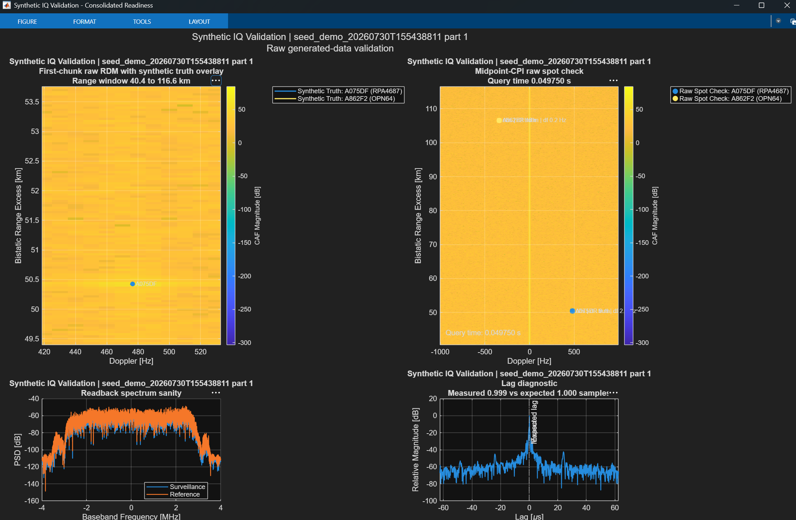

# Synthetic HDTV Simulation

This folder contains the MATLAB workflow for generating, packaging, and validating synthetic dual-channel HDTV passive-radar sessions for the existing bistatic analysis pipeline.

## What This Folder Now Does

- Generates packaged synthetic radar sessions that follow the existing session contract:
  - `radar/*.bb`
  - `truth/*`
  - `session_manifest.json`
- Supports both:
  - `zero_channels_v1`
  - `seed_backed_bistatic_v1`
- Can seed the synthetic radar IQ from a real field capture waveform.
- Can use captured ADS-B from a field session as the truth source.
- Preserves compatibility with `runBistaticAnalysisSession` by keeping the packaged-session ingest path unchanged.
- Supports newer archive-capable runs that can also save `archive/synthetic_session_archive.mat` as an offline companion artifact.

## Latest Synthetic Data To Reuse

The latest repo-side synthetic dataset currently documented for reuse is:

`captures/seed_demo_20260730T155438811/`

This session is pipeline-ready because it already contains:

- `radar/*.bb`
- `truth/*`
- `session_manifest.json`

Important facts about this dataset:

- The radar IQ is synthetic.
- The truth source is capture-backed ADS-B from the field session `captures/20260622T102123/`.
- The waveform seed also comes from that field session.
- The packaged session is ready for input into `runBistaticAnalysisSession`.
- This specific repo-side session does not include the newer `archive/synthetic_session_archive.mat` companion artifact.

## Example Output

The image below shows the RDM view and checks from the latest documented synthetic-data run.



## How To Use It

Run the existing packaged-session pipeline entrypoint against the documented session ID:

```matlab
out = runBistaticAnalysisSession('seed_demo_20260730T155438811');
```

If you need a fresh synthetic dataset, open and run:

- `seedBackedSyntheticHDTVSessionWalkthrough.m`

That walkthrough is the main user-facing entrypoint for building a new synthetic packaged session from the approved Apple Hill / CBS baseline, with optional field-seed and capture-backed truth inputs.

## Important Distinction

The documented session is not a raw field radar capture.

It is synthetic radar data generated from:

- a field-derived waveform seed, and
- field-captured ADS-B truth

That makes it appropriate for controlled workflow development and compatibility checks, while still being distinct from a direct field collection.

## Key Files In This Folder

- `seedBackedSyntheticHDTVSessionWalkthrough.m`: user-facing walkthrough to generate and inspect a synthetic session
- `generateSyntheticHDTVSession.m`: packaged-session generator
- `buildSyntheticHDTVBaselineScenarioConfig.m`: baseline scenario and timing defaults
- `helperSyntheticGenerateTruth.m`: truth generation
- `helperSyntheticWriteBasebandParts.m`: `.bb` packaging from synthesized channels
- `helperSyntheticValidateGeneratedIQ.m`: read-back and validation helper
