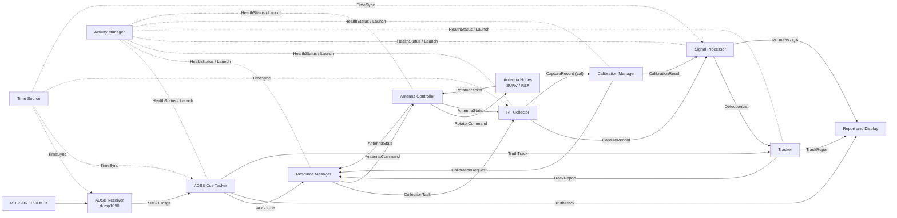

# System Architecture Overview

**System:** Apple Hill passive bistatic radar testbed (cued collection against aircraft, using Boston-area ATSC DTV as illuminators).

**Purpose of this document:** Source description for a MATLAB System Composer model. Each section below maps to a System Composer construct (see [System Composer Mapping](#system-composer-mapping)). Items marked *(proposed)* are first-draft suggestions to confirm or correct; items marked **TBD** are open.

**Current scope:** One bistatic observer station (N320 with a SURV and a REF Yagi, both on rotators), with multiple DTV illuminators in the region. A second receiving station may be added later, so components and interfaces carry an `observerId` so they don't need to be redesigned for it.

## Top-Level Flow

```
[Main Functions]
    [ADSB receiver] (existing dump1090 + rtl-sdr receiver + raspberry pi) ==>
    [ADSB cue tasker] (python - 'ADSB-remoter') ==>
        [resource manager] (compiled matlab)==>
        [RF Collector](matlab + hardware) ==>
            [Signal Processor] (matlab)]  ==>
            [Tracker] (matlab) ==> {two outputs: 1 to [reporter & display], 2 to [resource manager]}
                [Report and Display] (matlab)

    [Calibration Manager] ==> outputs to [Resource Manager]

[Supporting Functions]:
    [Activity Manager]
    [Antenna Controller]
    [Time Source]
```



The dashed links are supporting-function connections. In System Composer, draw them as separate views so the main data path stays readable.

---

# Application Deployment Policy

**Final state:** every MATLAB software item is a **compiled standalone application** (MATLAB Compiler) that runs on the **MATLAB Runtime**.

- **Target OS:** Linux (Ubuntu). Windows may be wanted later, so apps should avoid Linux-only assumptions (see Portability rules below).
- **Debug fallback:** the same entry point runs inside a MATLAB session, e.g. `matlab -batch "rmMain('config.json')"` or interactively.
- **Exceptions (not compiled MATLAB):**
  - Existing Python: the ADSB Cue Tasker (CT). "ADSB-Remoter" is the name of the same program.
  - System services: chrony, gpsd, dump1090 (Docker).
  - ESP32 firmware on the antenna nodes and gateway.

**Rules for every MATLAB app (proposed):**

1. **One entry point per software item.** For example, `rmMain(configPath)` is the entry point for the Resource Manager and compiles to `rm`. The same function runs compiled or in MATLAB, and `isdeployed` switches any behaviour that must differ (e.g. no `addpath` when compiled).
2. **Everything host-specific comes from configuration.** That covers hosts, ports, file paths, serial device names and radio names. It is read from the Activity Manager's configuration map (below), never hard-coded. This is what lets a software item move between machines.
3. **Portability:** build paths with `fullfile` and `tempdir`. Serial device names are configuration (`/dev/ttyUSB0` vs `COM3`). No shell-outs in the main path.
4. **Privileged host setup lives outside the apps.** The Linux network tuning in `log_iq_n320_2antennas.m` (MTU 9000, socket buffers, CPU governor) needs root. It moves into a one-time host setup script or systemd unit, and the compiled RF Collector only checks the settings and warns.
5. **Toolbox deployability must be verified before committing.** MATLAB Compiler supports most toolbox functions, but hardware support packages are the risk:
   - Wireless Testbench `usrp` / N320 radio setup and saved radio configurations
   - the ADALM-Pluto support package
   - `serialport` / `tcpserver` / `udpport`

   Build a small compiled "hello radio" for each before designing around it. **TBD**.

---

# Activity Manager Configuration Map *(proposed)*

The Activity Manager (AM) reads one JSON file (`system_config.json`) that says, for each software item, which host runs it, how to launch it, and where its IPC endpoints are.

- Every app is started with the path to that file plus its own ID, and looks up its peers' endpoints there. The IPC links therefore follow the map automatically.
- Moving a software item to another host is an edit to this file only (e.g. moving SP/TR to the Data Reduction PC).
- AM launches items on remote hosts through a small **host agent** on each machine. The agent is itself a compiled MATLAB app, or a systemd template unit started over ssh (**TBD**). It listens on the host-agent port and starts/stops local processes on AM's request.

```json
{
  "schemaVersion": 1,
  "hosts": {
    "rf-lenovo-mw":        { "ip": "192.168.10.41",  "os": "linux", "agentPort": 31994 },
    "rf-lenovo-dr-server": { "ip": "192.168.10.42",  "os": "linux", "agentPort": 31994 },
    "rf-pi":               { "ip": "192.168.10.131", "os": "linux", "agentPort": 31994 }
  },
  "items": {
    "RM": { "host": "rf-lenovo-mw", "mode": "compiled", "exe": "/opt/pbr/bin/rm",
            "matlabEntry": "rmMain", "listen": { "tcp": 31986 },
            "dependsOn": ["AC"], "restart": "always" },
    "SP": { "host": "rf-lenovo-mw", "mode": "matlab", "matlabEntry": "spMain",
            "listen": { "tcp": 31990 }, "restart": "on-failure" },
    "CT": { "host": "rf-pi", "mode": "python", "cmd": "python3 -m adsb_remoter",
            "listen": {}, "restart": "always" },
    "AR": { "host": "rf-pi", "mode": "service", "unit": "dump1090", "listen": { "tcp": 30003 } }
  },
  "paths": { "iqRoot": "/data/iq", "reducedRoot": "/data/reduced" },
  "devices": { "antennaGateway": "/dev/ttyUSB0", "radio": "My USRP N320" }
}
```

`mode` is one of `compiled | matlab | python | service`, which covers the debug fallback without a separate configuration. The Data Reduction PC address (192.168.10.42) is a placeholder that applies only if it joins the rooftop network.

---

# Interface Catalog *(proposed)*

> **Superseded by [ICD_Messages.md](ICD_Messages.md) (2026-09-25).** That file has the message schemas, rates and development status. The system adopts the ADSB Cue Tasker's snake_case envelope. The camelCase field names below are kept for history only.

These become entries in the System Composer **Interface Dictionary** (`PassiveRadarInterfaces.sldd`). Field lists are a starting point. Trim or extend them once the real message formats are fixed.

**Transport convention (decided: TCP/UDP):**

## Interprocess Communications 

- **TCP** for anything that must arrive: cues, tasks, detections, tracks, and calibration messages. Between components on the same PC it runs over `localhost`. Between the Pi and the RF Collection Desktop it runs over the rooftop data network (192.168.10.0/24).
- **UDP** for periodic, loss-tolerant traffic: heartbeats and antenna state broadcasts.
- Port numbers: Let's use 31984-31999 (if those don't conflict stringly with any known ports that are likely to be in use in this isolated system by other applications).
  - Checked: no well-known service uses this range. It also sits just below Linux's default ephemeral range (32768–60999) and far below Windows' (49152–65535), so the OS won't hand these ports out to outgoing connections. Nothing else on this isolated network (dump1090 30001–30005, gpsd 2947, NTP 123, UHD 49152+) overlaps.
  - Each **receiving** app gets one port, and every message carries a `type` field, so one listener handles several interfaces:

| Port | Proto | Listener | Receives |
|---|---|---|---|
| 31984 | TCP | Activity Manager (AM) | control / status queries |
| 31985 | UDP | Activity Manager (AM) | `HealthStatus` heartbeats |
| 31986 | TCP | Resource Manager (RM) | `ADSBCue`, `TrackReport`, `CalibrationRequest` |
| 31987 | TCP | RF Collector (RC) | `CollectionTask` |
| 31988 | TCP | Antenna Controller (AC) | `AntennaCommand` |
| 31989 | UDP | broadcast (RM, RC, RD listen) | `AntennaState` |
| 31990 | TCP | Signal Processor (SP) | `CaptureRecord`, `CalibrationResult` |
| 31991 | TCP | Tracker (TR) | `DetectionList`, `TruthTrack` |
| 31992 | TCP | Report & Display (RD) | `TrackReport`, `TruthTrack`, QA notices, schedule, health summary |
| 31993 | TCP | Calibration Manager (CM) | `CaptureRecord` (cal) |
| 31994 | TCP | Host agent (every host) | launch / stop requests from AM |
| 31995–31999 | | spare | second observer, debug taps |

- **Message envelope (proposed):** every JSON line is `{"type", "schemaVersion", "msgId", "src", "dst", "timeUTC", "payload"}`. Units go in the field names (`_Hz`, `_deg`, `_m`, `_s`), and all times are ISO-8601 UTC.
  
##  **Antenna Control**

- ESP-NOW Packets with CRC and ACK

## **Payload:** 

- newline-delimited JSON. Python (`json`) and MATLAB (`jsonencode`/`jsondecode`, `tcpclient`/`tcpserver`, `udpport`) both handle it natively.

## **Bulk IQ** 

- Never goes over a socket. Messages carry the `.bb` file path.

| Interface | Producer → Consumer | Transport | Key fields |
|---|---|---|---|
| `SBSMessage` | ADSB Receiver → ADSB Cue Tasker | TCP 30003 (SBS-1 CSV), local on Pi | msgType, icao24, callsign, time, lat, lon, alt_ft, gs_kt, track_deg, vrate |
| `TruthTrack` | ADSB Cue Tasker → Tracker, Report & Display | TCP, Pi → Desktop | icao24, callsign, time[], lat/lon/alt[], vel[], per-illuminator predicted bistatic range/Doppler[] |
| `ADSBCue` | ADSB Cue Tasker → Resource Manager | TCP, Pi → Desktop | cueId, icao24, windowStartUTC, windowEndUTC, illuminatorId, rfFreq_Hz, predCPA_m, predPeakSNR_dB, predSNRProfile, beamEntryUTC, beamExitUTC, recommendedSurvAz_deg, priority |
| `CollectionTask` | Resource Manager → RF Collector | TCP localhost | taskId, observerId, reason {cue, track, cal, survey}, startUTC, duration_s, illuminatorId, cf_Hz, sr_Sps, lo_Hz, gain_dB (per chan), antennaPorts, survAz_deg, refAz_deg, outputPath |
| `AntennaCommand` | Resource Manager → Antenna Controller | TCP localhost | taskId, antenna {SURV, REF}, targetAz_deg, tolerance_deg, deadlineUTC |
| `RotatorCommand` | Antenna Controller → Antenna Node | USB serial → ESP32 gateway → ESP-NOW | nodeId, seq, cmd {goTo, stop, calSweep}, targetAz_deg |
| `RotatorPacket` | Antenna Node → Antenna Controller | ESP-NOW → ESP32 gateway → USB serial | nodeId, seq, trueHeading_deg, magRaw[3], accelRaw[3], fieldStrength_uT, moving, (ack/fault code) |
| `AntennaState` | Antenna Controller → RF Collector, Resource Manager | UDP broadcast / localhost | timeUTC, antenna {SURV, REF}, az_deg, tilt_deg, fieldStrengthFlag, tiltFlag, moving, lastHeartbeatUTC |
| `CaptureRecord` | RF Collector → Signal Processor, Calibration Manager | `.bb` file + `Metadata` struct; notification by TCP | taskId, observerId, filePath, startUTC (host NTP clock), cf, sr, lo, gain, radio, antennaPorts, survAz/refAz with quality flags, antenna last-transmit times, MATLAB release, status {ok, drops, fail} |
| `CalibrationRequest` | Calibration Manager → Resource Manager | TCP localhost | calType {pluto tone, multitone, noise floor, az scan, rotator mag sweep}, earliestUTC, latestUTC, priority |
| `CalibrationResult` | Calibration Manager → Signal Processor, Activity Manager | MAT/CSV artifact; notification by TCP | calId, timeUTC, verdict {PASS, WARN, FAIL}, per-channel gain/phase/freq offset, coherence, baselineRef |
| `DetectionList` | Signal Processor → Tracker | TCP localhost | taskId, cpiTimeUTC, observerId, illuminatorId, bistaticRange_m, doppler_Hz, snr_dB, quality |
| `TrackReport` | Tracker → Report & Display, Resource Manager | TCP localhost | trackId, illuminatorId, timeUTC, state [R, Rdot] (bistatic), covariance, associatedIcao24, trackQuality, nextUpdateDueUTC |
| `HealthStatus` | All → Activity Manager | UDP 31985 → AM (RF Collection Desktop) | component, host, state {up, degraded, down}, lastHeartbeatUTC, message |
| `TimeSync` | Time Source → all hosts | NTP (chrony) | stratum, offset_s, ppsLocked |

---

# Software Item Architecture

## Main Functional Items

### ADSB receiver (AR)

    Overview: Runs dump1090 on the Raspberry Pi on the internal test network. Decodes 1090 MHz Mode-S / ADS-B and serves decoded messages over TCP.
    Inputs: RTL-SDR IQ (1090 MHz, USB)
    Outputs: SBSMessage stream (TCP 30003, SBS-1 BaseStation format); raw Beast (30005) available
    Source: Docker image https://hub.docker.com/r/jraviles/dump1090, hosted on the Pi
            Logging: 22_pluto_test_setup_sync/ADSB_GPS/gatherTCPcompress.py, start_adsb_gps_loggers.sh
    Details: Also acts as the ground-truth source for detection and track scoring
    Host: Raspberry Pi, large electronics enclosure, Apple Hill East Parking Lot (AHEP)
    Status: Operating

### ADSB cue tasker (CT)

    Also known as: ADSB-Remoter. This is the same program, and ADSB-Remoter is its repository and program name.

    Overview: Gathers dump1090 SBS reports into ADS-B tracks and generates cues for the Resource Manager. Extrapolates aircraft paths through the known HDTV emitter landscape around Boston (Boston_HDTV_tower_list.md) to estimate (1) CPA to the bistatic observers; (2) current and peak expected bistatic SNR along the path; (3) best illumination candidates: the best illuminator/channel per aircraft, and the time window when the aircraft enters the surveillance antenna beam.
    Inputs: SBSMessage; emitter database (20_DTV_direct_path_input.csv, Boston_HDTV_tower_list.md); observer site geometry and antenna pointing (SiteGeometry.md); antenna pattern (proposed)
    Outputs: ADSBCue; TruthTrack (for the Tracker and scoring)
    Source: Python, 'ADSB-remoter' : repo location https://github.com/lhilleMAT2022/ADSB-remoter
    Details: Prediction horizon and cue threshold (min predicted SNR) TBD. Because the Tracker works in bistatic range-Doppler, TruthTrack should also carry ADS-B truth projected into bistatic range/Doppler per illuminator (proposed; compare BistaticDataAnalysis/adsbToBistatic.m).
    Host: Raspberry Pi
    Status: Rev 1 developed, in development

### Resource Manager (RM)

    Overview: Plans RF collection tasking. Resolves conflicts between cue-driven, track-maintenance, and calibration tasks for the one N320 and two rotator-mounted antennas.
    Inputs: 1. ADSBCue from ADSB Cue Tasker; 2. TrackReport from Tracker; 3. CalibrationRequest from Calibration Manager; 4. AntennaState; 5. HealthStatus (proposed)
    Outputs: CollectionTask (to RF Collector); AntennaCommand (to Antenna Controller); task schedule/log (to Report & Display, proposed)
    Source:  MATLAB, runs in MATLAB App or as Standalone Linux app with MATLAB Runtime.
    Details: Two planning loops (decided):
             - Short loop, 1 min: tasks new tracks, track updates for maneuvers, and other collections as needed. Most collections are under 15 s.
             - Long loop, 5 min: maintains a prioritized queue of upcoming cued and scanning surveillance collections, periodic track-update collections, and all upcoming calibration checks.
             Scheduling policy TBD, e.g. priority = f(predicted SNR, track need, cal overdue). Must account for:
             - Rotator slew time. The rotators have no speed control and only toggle direction, so a large re-point can take tens of seconds.
             - Antennas not moving during captures.
             - Disk and transfer throughput (see Storage under Remaining Open Items).
    Host: RF Collection Desktop
    Status: Planned

### RF Collector (RC)

    Overview: Manages the bistatic observer hardware. Executes CollectionTasks: tunes the N320, confirms both antennas are stopped on bearing, records dual-channel IQ, and writes .bb files with a metadata sidecar.
    Inputs: CollectionTask; AntennaState; TimeSync
    Outputs: CaptureRecord (.bb files: CH1 = Surveillance/RX1, CH2 = Reference/RX2, complex int16)
    Source: MATLAB + Wireless Testbench: 10_Data_Samples/00_Analysis_and_Capture_MATLAB/log_iq_n320_2antennas.m, hCaptureAntennas.m, hRadioHardware.m
    Details: ~500–600 MHz, 5–6.144 MSps, +200 kHz LO offset, 20 ms–10 s snapshots. Configures Linux networking itself (MTU 9000, socket buffers, CPU governor). Free-running LOs, so CFO is corrected downstream. Capture timestamps come from the host clock (NTP from the Time Source); the N320 does not take PPS/10 MHz (decided).
    Host: RF Collection Desktop (via rooftop data network to the N320)
    Status: Rev 1 developed, in development

### Signal Processor (SP)

    Overview: Turns captures into detections. Runs reference quality and direct-path prechecks, CFO/phase correction, direct-path/clutter cancellation (ECA-C), CAF range-Doppler map, and CFAR detection.
    Inputs: CaptureRecord; CalibrationResult; illuminator/geometry configuration
    Outputs: DetectionList (tagged by illuminatorId); RD maps and QA artifacts (to Report & Display)
    Source: MATLAB: passiveRD_bb.m, assess_bb_quality.m; 22_pluto_test_setup_sync/BistaticDataAnalysis/ (analyzeBistaticData.m, runDirectPathPrecheck.m, mitigateClutter.m, createRDM.m, detectTargets.m)
    Details: Target is near-real-time. Each capture should be processed before the Resource Manager's next short-loop decision, which sets the latency budget (~10–20 s per capture, proposed). Detector not yet functional (checkpoint 2026-07-08). Toolbox variants (phased.CFARDetector2D, phased.TDOAEstimator) are under evaluation. A 10 s dual-channel capture at 6.144 MSps is ~2 GB in double precision, so single precision or chunked processing is advisable on the 16 GB desktop. Full offline reprocessing stays on the RF Data Reduction Desktop.
    Host: RF Collection Desktop (near-real-time); RF Data Reduction Desktop (offline reprocessing)
    Status: Rev 1 developed, in development

### Tracker (TR)

    Overview: Associates detections over time into bistatic range-Doppler tracks, one track set per illuminator. Feeds track state back to the Resource Manager for track-maintenance tasking.
    Inputs: DetectionList; TruthTrack (for association aid and scoring)
    Outputs: TrackReport (to Report & Display and Resource Manager)
    Source: MATLAB, Sensor Fusion and Tracking Toolbox (e.g. trackerGNN/trackerJPDA) proposed
    Details: Track domain: bistatic range and range-rate, with multiple illuminators in the region (decided). Geographic (lat/lon/alt) fusion across illuminators is a possible later extension that would need no new hardware. Existing truth alignment: BistaticDataAnalysis/adsbToBistatic.m, alignTruthToRadar.m, assessTruthVsDetections.m
    Host: RF Collection Desktop
    Status: Planned

### Report and Display (RD)

    Overview: Displays tracks and system status. Produces capture/session reports and truth-vs-detection scoring.
    Inputs: TrackReport; TruthTrack; DetectionList/RD maps; HealthStatus; CalibrationResult; AntennaState; task schedule
    Outputs: Operator display; HTML/PNG/MAT session reports; published datasets
    Source: MATLAB (app / geoglobe / static HTML reports; see BistaticDataAnalysis visualization profiles)
    Details: Live display on the RF Collection Desktop. An auxiliary or offline display can run on the RF Data Reduction Desktop over the Development Network.
    Host: RF Collection Desktop (primary); RF Data Reduction Desktop (auxiliary)
    Status: Planned

### Calibration Manager (CM)

    Overview: Plans calibration tasks, evaluates their results against a commissioned baseline, and publishes the current calibration state.
    Inputs: CaptureRecord (calibration captures); commissioned baselines; HealthStatus
    Outputs: CalibrationRequest (to Resource Manager); CalibrationResult (to Signal Processor, Activity Manager)
    Source: MATLAB: 22_pluto_test_setup_sync/TestSetupTesting/ (runPlutoMultitoneCalibrationBaseline.m, runPlutoMultitoneCalibrationCheck.m, runPlutoTonePrecheck.m, runPlutoAzimuthEnvironmentalScan.m)
    Details: Uses Pluto SDR multitone injection as the calibration source. PASS/WARN/FAIL health check before collection. Also owns the rotator heading calibration (magnetometer hard/soft-iron sweep and RF-truth bearing anchoring; see antenna_controller.md), requesting it from the Resource Manager like any other cal task. The azimuth environmental scan becomes unattended once the Antenna Controller exists.
    Host: RF Collection Desktop (needs the Pluto and N320 at the same time)
    Status: Planned, in development

## Supporting Functions

### Activity Manager (AM)

    Overview: Monitors main and supporting functions. Launches functions that do not run continuously (e.g. batch Signal Processor runs, calibration).
    Inputs: HealthStatus from all components; CalibrationResult
    Outputs: Launch/stop commands; health summary (to Report & Display)
    Source: Matlab Compiled Application . 
    Details: Driven by system_config.json (see Activity Manager Configuration Map). Starts each software item on its configured host in its configured mode (compiled / matlab / python / service), passes it the config path so its IPC links point the right way, watches heartbeats on UDP 31985, and restarts items according to their restart policy. Remote hosts (Pi, Data Reduction PC) are reached through the host agent on TCP 31994.
    Host: RF Collection PC
    Status: Planned, in development

### Antenna Controller (AC)

    Overview: Detects and reports antenna orientation. Plans and commands pointing of the SURV and REF Yagis.
    Inputs: AntennaCommand; RotatorPacket from the antenna nodes
    Outputs: AntennaState; RotatorCommand
    Source: MATLAB `rotatorLink` class wrapping `serialport` to the ESP32 gateway: heading(node), goTo(node, deg), logger (proposed; see antenna_controller.md). ESP32 firmware on the antenna nodes and gateway.
    Details: Both SURV and REF are rotator-mounted Yagis. The existing rotators turn only while the button is held, alternate direction on each press, have no position feedback, and bounce at end of travel. The antenna node closes a relay across the button, watches heading at ~10 Hz, corrects direction if needed, and releases early to allow for coast. Failsafes release the relay on stall, link loss, or maximum hold time. Headings are valid only while the rotator is stopped. Nodes are quiet during captures (transmitting only on a >0.5° change or a 10 s heartbeat).
    Host: RF Collection Desktop (+ ESP32 gateway on USB); ESP32 nodes in each antenna's enclosure
    Status: Proposed design, not built

### Time Source

    Overview: Stratum-0 time server running chrony and gpsd with 1-PPS input from a GPS receiver
    Inputs: GPS NMEA + 1-PPS
    Outputs: TimeSync (NTP to network hosts); gpsd on TCP 2947; NMEA logs (gatherNMEAcompress.py)
    Source: OS function (chrony, gpsd)
    Details: Parses NMEA and 1-PPS pulses from the GPS receiver. Hosts discipline to it via NTP. The N320 stays free-running, with no PPS/10 MHz (decided).
    Host: Raspberry Pi
    Status: Operating

---

# Hardware Items

These become components in the **physical architecture**. Software components above are allocated to them (see the allocation table below).

## Processing & Networking

### RF Collection Desktop

    Role: Data collection and near-real-time processing PC. Hosts the RF Collector, Calibration Manager, Resource Manager, Antenna Controller, Signal Processor (near-real-time), Tracker, and Report and Display.
    OS: Linux - Ubuntu 26
    Interfaces: Rooftop data network to N320 (en0, 192.168.10.41); management network (en1, 192.168.11.10, planned); USB to Pluto; USB to ESP32 gateway; Development Network (ZeroTier 172.25.20.164)
    Location: AHEP glass stairwell Computer Enclosure / rooftop station
    Hostname: rf-lenovo-mw
    Hardware: Lenovo 12-Core i7 Processor with 16GB Ram, 512GB HDD

### RF Data Reduction Desktop

    Role: Offline processing. Potentially host Auxiliary Display Function.
    OS: Linux - Ubuntu 26
    Interfaces: Development Network (ZeroTier 172.25.178.33); capture storage (rsync from RF Collection Desktop)
    Location: AH2 - 2nd Floor
    Hostname: rf-lenovo-dr-server
    Hardware: Lenovo 12-Core i7 Processor with 16GB Ram, 250GB HDD
    Option (under consideration): Move it onto the Rooftop Data Collection Network (a copper port on Switch A or B) so that processing and storage are local:
      - Work could then be split between the two PCs, e.g. RC, RM, CM, AC and AM on rf-lenovo-mw, and SP, TR and RD on rf-lenovo-dr-server.
      - Each ~15 s capture (~740 MB) would copy in ~6 s at 1 GbE or ~2.5 s at 2.5 GbE, instead of going over Wi-Fi.
      - The split is only a change to system_config.json.
      - Decide after measuring SP/TR load on rf-lenovo-mw (see Remaining Open Items).

### Raspberry Pi

    Role: Hosts the ADSB Receiver (dump1090 in Docker), ADSB Cue Tasker, Time Source (chrony/gpsd), and a host agent for the Activity Manager. Also runs the ADS-B/GPS loggers.
    Interfaces: USB to RTL-SDR; GPS HAT (serial + PPS GPIO); rooftop data network (eth0, 192.168.10.131)
    Location: Large electronics enclosure, AHEP

### Network Switches

    Role: Internal test network and GB fiber backhaul between rooftop stations
    Details: 6-port switches:  4x 1/2.5GB Copper; 2x SFP+ sockets up to 10GB  
    Location: (1) Switch A: AHEP glass stairwell Computer Enclosure / rooftop station; (2) Switch B: Large electronics enclosure, AHEP

### Networks

#### Rooftop Data Collection Network
    Role: Internal between RF Elements at AHEP
    Speed: Currently 1GB --> upgrade to 10Gb considered.
    Status: Operating at 1GB
    Upgrade: Considering upgrade to 10GB for Data only and adding management network (items marked *)
    Status: Active
    Note: 1 GbE carries the current capture rate. At 6.144 MSps × 2 channels × 4 bytes (sc16) the stream is ~49 MB/s (~393 Mbit/s), about 40% of the link. The 10 GbE upgrade matters for higher sample rates or a second observer on the same backhaul.

                         10 GbE multimode fiber SFP+ <===> SFP+
                              LC <========> LC
                                  │      │
                                  │      │
                           ┌──────┘      └──────┐
                           │                    │
                    ┌──────┴──────┐      ┌──────┴──────┐
                    │  Switch A   │      │  Switch B   │ -------------+
                    └───┬─────┬───┘      └───┬─────┬───┘              |
                        │     │              │     │                  |
       10 GbE DAC*      │     │ Cat6     Cat6│     │ 10 GbE DAC*      |
       SFP+ <===> SFP+  │     │RJ-45    RJ-45│  SFP+ <===> SFP+       |
                        │     │              │     │                  |
                  ┌─────┴─────┴─────┐  ┌─────┴─────┴──────┐     ┌─────┴────────┐
                  │   RF Collection |  │    N320 USRP     │     |   Rasp. Pi   |
                  |   Desktop PC    │  |                  |     |              |
                  │                 │  │                  │     |              |
                  │ en0: DATA       │  │ eth0: DATA       │     |  eth0:Data   |
                  │ 192.168.10.41/24│  │ 192.168.10.2/24  │     |192.168.10.131|
                  │                 │  │                  │     └──────────────┘
                  │ en1: MANAGEMENT*│  │ eth2: MANAGEMENT*│
                  │ 192.168.11.10/24│  │ 192.168.11.20/24 │
                  └─────────────────┘  └──────────────────┘

#### Development Network

    Carrier: MathWorks Personal Device Network (Wifi)
    Logical: ZeroTier VPN
    Speed: Slow due to poor wifi at AHEP
    Clients:
       #ZT ADSB Network
        172.25.20.164    rf-lenovo-mw
        172.25.178.33    rf-lenovo-dr-server

    (1) rf-lenovo-mw: Lenovo 12-Core i7 Processor with 16GB Ram, 512GB HDD

    (2) rf-lenovo-dr-server: Lenovo 12-Core i7 Processor with 16GB Ram, 250GB HDD
    Location: Apple Hill
    Note: This is the only path from the RF Collection Desktop to the RF Data Reduction Desktop, so rsync of captures is limited by the AHEP Wi-Fi.
    Status: Active

#### ESP-NOW Antenna Management Network
    Carrier: 2.4 GHz
    Function: Control & Status of Antenna Pointing Angle from RF Collection PC
    Protocol: ESP-NOW wrapped json control and status packets between the RF Collection Desktop and the Antenna Controllers
    Location: AHEP
    Hosts:
        Node 0: RF Collection PC (ESP32 gateway on USB serial)
        Node 1: Surveillance Antenna (SURV)
        Node 2: Reference Antenna (REF)
    Details: Acknowledged ESP-NOW on one fixed Wi-Fi channel at reduced transmit power. REF's broadband LNA (20 MHz–4 GHz) covers 2.4 GHz, so nodes stay quiet during captures. Heartbeat times are recorded in the capture metadata.
    Status: planned

## RF Receivers

### USRP N320

    Role: Dual-channel bistatic observer receiver (RF0:RX2 = surveillance, RF1:RX2 = reference)
    Interfaces: Rooftop data network (eth0, 192.168.10.2; currently 1 GbE via Switch B, 10 GbE DAC planned); management (eth2, 192.168.11.20, planned); SMA to antenna/filter/amp chain. No PPS/10 MHz reference (decided).
    Location: Large electronics enclosure, AHEP

### Pluto SDR Radio

    Role: Calibration signal source (tone / multitone injection)
    Interfaces: USB to RF Collection Desktop; TX antenna or coupled injection
    Location: AHEP glass stairwell Computer Enclosure / rooftop station

### GPS Receiver

    Role: Time and position reference for the Time Source
    Interfaces: NMEA + 1-PPS to Raspberry Pi
    Hardware: Adafruit GPS Hat for Raspberry Pi
    Location: Attached to Raspberry Pi, Large electronics enclosure, AHEP

### RTL-SDR Receiver

    Role: 1090 MHz ADS-B receiver
    Interfaces: USB to Raspberry Pi; 1090 MHz antenna
    Location: Attached to Raspberry Pi, Large electronics enclosure, AHEP

## Other Hardware

### Antenna Orientation Module

    Role: Measures and controls the azimuth of each rotator-mounted Yagi (SURV and REF). Design details: antenna_controller.md
    Status: Proposed design, not built (2026-09-25)
    Composition (one Antenna Node per antenna, plus one Gateway):

    Antenna Node (x2: Node 1 SURV, Node 2 REF), in each rotator controller's weather enclosure (~6–8 ft from the antenna):
      - ESP32, powered from a 5 V USB adapter in the enclosure (mains; not tapped from the rotator supply or the coax)
      - Adafruit STEMMA mini relay (4409), wired across the rotator controller's button contacts
      - Adafruit LSM303AGR accel + magnetometer (4413), on a non-ferrous standoff at least 30 cm above the rotator.
        The accelerometer tilt-compensates the heading (field dip is ~66°, so 1° of tilt can cause up to ~2.3° of heading error).
        Connects over an 8 ft I2C cable with a service loop, at 10–50 kHz; fallback is a PCA9615 differential I2C extender over Cat5.
      - Optional: Adafruit MMC5603 (5579) second magnetometer for cross-checking; its SET/RESET cancels offset drift

    Gateway (Node 0): ESP32 on USB serial at the RF Collection Desktop, near the stairwell glass.
      Uses an external-antenna ESP32 if coated glass limits range.

    Rejected parts: HMC5883L (end-of-life, often really a QMC5883L); MAX4544 (unknown button voltage and ground); ICM-20948 (weakest magnetometer; its gyro is a possible later upgrade)
    Calibration: hard/soft-iron fit from a full-travel sweep; magnetic-to-true correction (~14° W declination at Natick, to be checked with NOAA); RF-truth anchor on the main DTV towers (~83° true) and the Pluto injector bearing. Don't use channel 22 (Hudson, 309°) as a SURV reference because the stairwell shadows it.
    Open items: ESP32 board models on hand; sensor standoff and service-loop mounting details

### Rotators (x2)

    Role: Azimuth rotation for the SURV and REF Yagis (existing)
    Interfaces: Rotator power and the antenna's built-in LNA are fed up the coax from each rotator controller (15 VAC wall supply). Control is one momentary button that alternates direction on each press.
    Limitations: No position feedback; bounces at end of travel; no speed control
    Locations: 
       1. For Surveillance Antenna: Large electronics enclosure, AHEP 
       2. For Reference Antenna: Small electronics enclosure, AHEP

### Antennas and RF Front End

    Items:
    1. SURV & REF Antennas: Rotating Boosted HDTV Yagi 
    2. Pluto SDR: 
       1. TX - 600MHz Tuned Monopole; 
       2. RX - Commercial Pigtail Antenna
    Notes: S-parameters in 90_antenna_stuff/matlab_design/; RF switching (relay/SPDT/matrix switch) under consideration for cal injection and filter bypass.
    Receive chains (SiteGeometry.md, 2026-09-24):
      - REF (RF1:RX2): Yagi with built-in LNA → rotator controller → Nooelec Lana wideband LNA (20 MHz–4 GHz) → ~100 ft coax → N320
      - SURV (RF0:RX2): Yagi with built-in LNA → rotator controller → coax → N320
    Known issue: REF is overloaded at every N320 gain with the Lana fitted, and SURV is linear only up to ~10 dB gain. Until a pad or channel BPF is added, the RF Collector's default RadioGain is [SURV REF] = [10 0].
    Site layout, pointing, and injector placement options: SiteGeometry.md

---

# Allocation

In System Composer this is an **Allocation Set** from the functional/software model to the physical model.

| Software component | Allocated to |
|---|---|
| ADSB Receiver | Raspberry Pi (+ RTL-SDR) |
| Time Source | Raspberry Pi (+ GPS Receiver) |
| ADSB Cue Tasker | Raspberry Pi |
| Activity Manager | RF Collection Desktop (host agents on Pi and Data Reduction Desktop) |
| Resource Manager | RF Collection Desktop |
| RF Collector | RF Collection Desktop (+ USRP N320) |
| Calibration Manager | RF Collection Desktop (+ Pluto SDR) |
| Antenna Controller | RF Collection Desktop (+ ESP32 Gateway) → Antenna Nodes (SURV, REF) |
| Signal Processor | RF Collection Desktop (near-real-time); RF Data Reduction Desktop (offline) |
| Tracker | RF Collection Desktop |
| Report and Display | RF Collection Desktop (primary); RF Data Reduction Desktop (auxiliary) |

---

# System Composer Mapping

| This document | System Composer construct |
|---|---|
| Main / Supporting Functions | Components in a **functional (logical) architecture model**, e.g. `PassiveRadar_Functional.slx` |
| Hardware Items | Components in a **physical architecture model**, e.g. `PassiveRadar_Physical.slx` |
| Networks | Connectors in the physical model, stereotyped `NetworkLink` |
| Inputs / Outputs | Ports, typed by interfaces |
| Interface Catalog | **Interface Dictionary** (`PassiveRadarInterfaces.sldd`) |
| Host / Source / Status fields | **Profile stereotypes** (below) |
| Allocation table | **Allocation Set** (functional → physical) |
| Supporting-function links, per-status subsets | **Architecture views**, e.g. "Main data path", "Health & timing", "Antenna control", "Status = Planned" |

**Proposed profile `PassiveRadarProfile`:**

- `SoftwareComponent`: ItemId (string, e.g. "RM"), Language {MATLAB, Python, Firmware, OS/Service}, Deployment {Standalone+Runtime, MATLABSession, Python, SystemService, Firmware}, EntryPoint (string), SourcePath (string), ListenPort (int), Status {Operating, InDevelopment, Planned, Proposed}, Rev (string)
- `HardwareComponent`: Model (string), Location (string), OS (string), Hostname (string), Status
- `NetworkLink` (connector): Medium {10GbE, GbE, Fiber, ZeroTier/WiFi, ESP-NOW, USB, I2C, Serial, RF}, Subnet (string), Port (int)
- `Message` (interface): Transport {TCP, UDP, File, ESP-NOW/Serial, NTP}, Encoding {JSON, CSV, MAT, BB}

The existing `22_pluto_test_setup_sync/BistaticDataAnalysis/architecture/bistaticAnalysisQuickReference.slx` already models the inside of the analysis pipeline. It can become the **decomposition of the Signal Processor** component, as a referenced model, instead of being redrawn.

---

# Decisions (2026-09-25)

1. **Resource Manager planning loops:**
   - Short, 1 min: new tracks, maneuver updates, and ad-hoc collections. Most collections are under 15 s.
   - Long, 5 min: prioritized queue of cued and scanning surveillance, periodic track updates, and all upcoming calibration checks.
2. **Transport:** TCP or UDP, with newline-delimited JSON. Many functions reside on a single PC.
3. **Ports:** 31984–31999; assignments are in the Interprocess Communications table.
4. **ADSB Cue Tasker third output:** best illumination candidates (illuminator/channel and beam-entry window). See its component section.
5. **Tracker domain:** bistatic range-Doppler, with multiple illuminators in the region.
6. **Signal Processor timing:** near-real-time is the goal.
7. **Observers:** one bistatic observer for now; a second receiving station may be added.
8. **Rotator hardware and orientation sensing:** ESP32 / ESP-NOW antenna nodes. See antenna_controller.md and the Antenna Orientation Module section.
9. **N320 PPS/10 MHz from the Time Source:** no.
10. **Hosts:** the ADSB Cue Tasker runs on the Raspberry Pi. The Activity Manager runs on the RF Collection PC.
11. **Storage (RF Collection Desktop):**
    - Keep the most recent 200 GB of IQ and 100 GB of reduced data on the local disk.
    - Push the prior 100 GB of reduced data to the Data Reduction Desktop over the slow link.
12. **Applications:** compiled standalone MATLAB apps on the MATLAB Runtime, Linux first and Windows-capable. Running in a MATLAB session is the debug fallback. Python items and system services are the exceptions (see Application Deployment Policy).
13. **Activity Manager:** reads a JSON configuration map that assigns each software item to a host, launches it there, and wires its IPC links.
14. **Item IDs:** AR, CT, RM, RC, SP, TR, RD, CM, AM, AC. The ADSB Cue Tasker is CT, so it doesn't clash with the Antenna Controller (AC). "ADSB-Remoter" is the same program as CT.

# Remaining Open Items

1. **ADSB Cue Tasker:** prediction horizon and minimum predicted-SNR cue threshold.
2. **Near-real-time budget:** measure Signal Processor runtime per capture on rf-lenovo-mw (16 GB RAM) against the 1 min short loop. The result decides whether SP/TR move to the Data Reduction PC.
3. **Data Reduction PC on the rooftop network:** move it or not, based on item 2. If it moves, set its data-network IP and physical location.
4. **Compiler deployability check:** build minimal compiled apps that
   - open the N320 with Wireless Testbench,
   - transmit from the Pluto,
   - open `serialport`, `tcpserver` and `udpport`,

   all on Ubuntu with the MATLAB Runtime. Owner: Leif, testing on the RF Data Reduction Desktop.
5. **Host agent mechanism:** a compiled MATLAB agent vs. ssh + systemd template units. Also decide on authentication on the isolated network.
6. **Scheduling policy** inside the Resource Manager loops (priority function, preemption rules).
7. **JSON schemas:** write the per-interface field list and units using the envelope above, e.g. as a `schemas/` folder or in the interface dictionary.
8. **Antenna Orientation Module:** ESP32 board models on hand; sensor standoff and service-loop mounting.
9. **Missing file:** `dtvPredictDirectPath.m`, which SiteGeometry.md cites for the bearings, distances and predicted levels, is not in this folder. `20_DTV_direct_path_input.csv` is now here, and `dtvFitPointing.m` can be ignored.
10. **Second observer station:** confirm that `observerId` in the interfaces is enough, and decide whether the Tracker would then fuse across observers.
